# 餐食管理系统 - 数据库结构和数据流（修正版）

## 目录
- [数据库表结构](#数据库表结构)
  - [基础模型](#1-基础模型)
  - [菜单管理模块](#2-菜单管理模块)
  - [客户管理模块](#3-客户管理模块)
  - [用户与权限模块](#4-用户与权限模块)
  - [食材与库存管理模块](#5-食材与库存管理模块)
  - [服务管理模块](#6-服务管理模块)
  - [配送与排餐模块](#7-配送与排餐模块)
  - [月子餐管理模块](#8-月子餐管理模块)
  - [AI分析与报告模块](#9-ai分析与报告模块)
- [系统架构图](#系统架构图)
- [核心数据流图](#核心数据流图)
- [主要优化和改进](#主要优化和改进)

## 数据库表结构

### 1. 基础模型

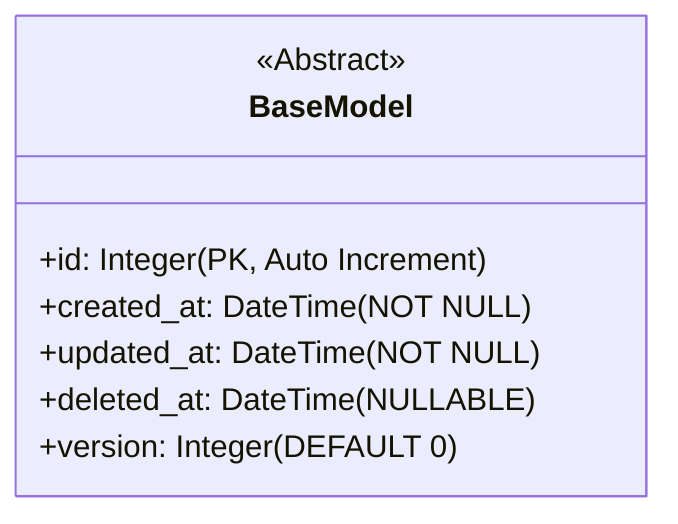

### 2. 菜单管理模块

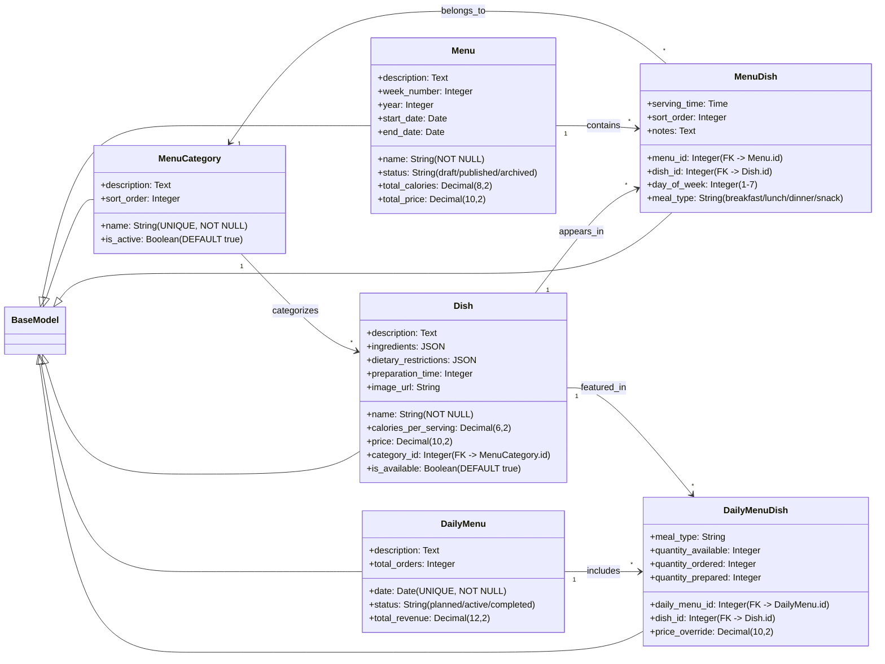

### 3. 客户管理模块

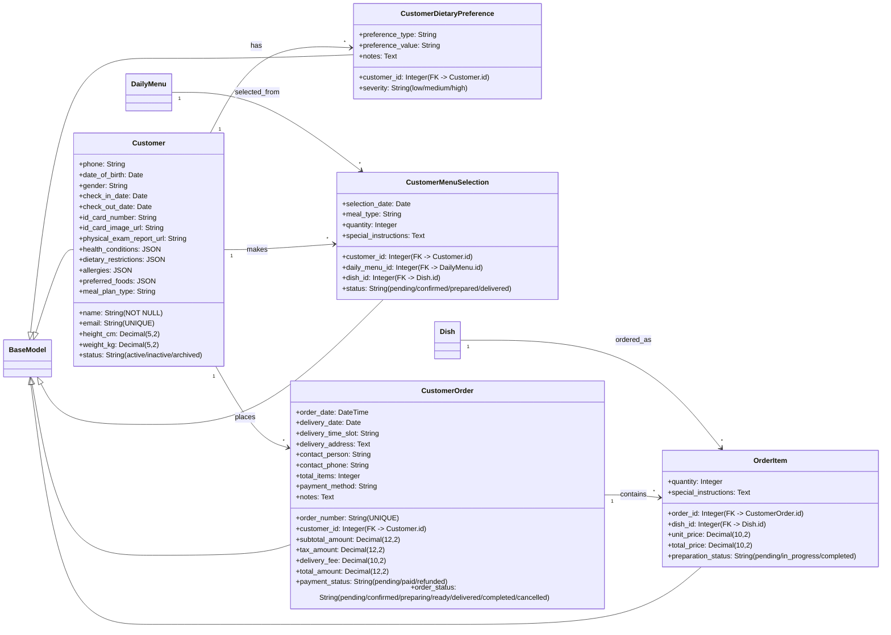

### 4. 用户与权限模块

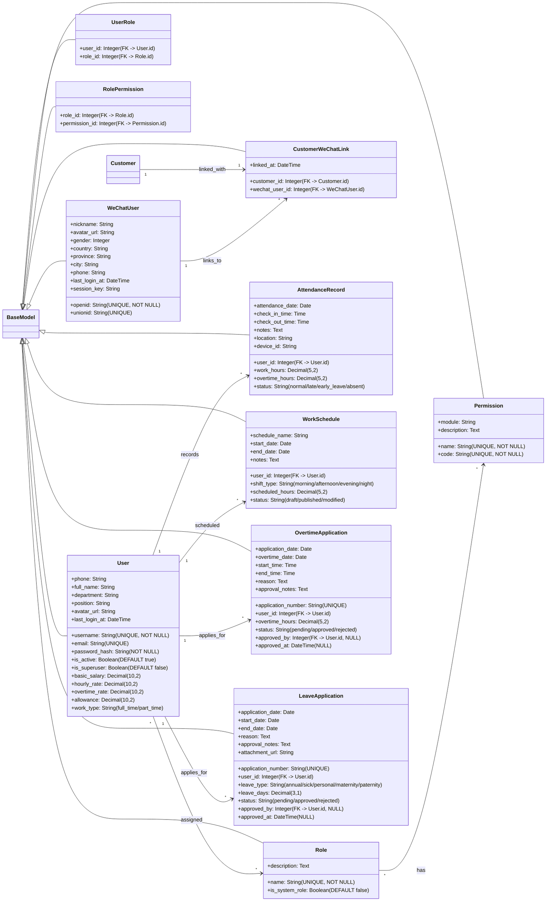

### 4.1 员工薪资与奖金模块

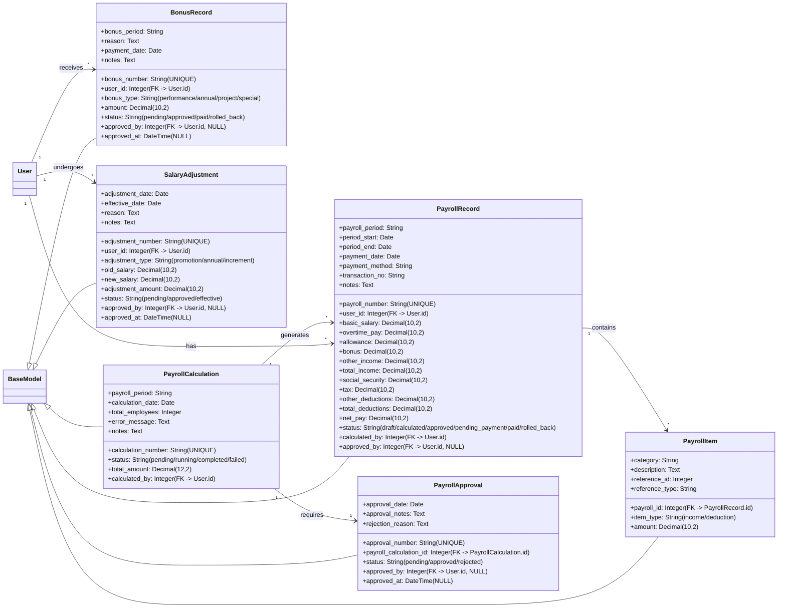

### 4.2 员工工作量统计模块

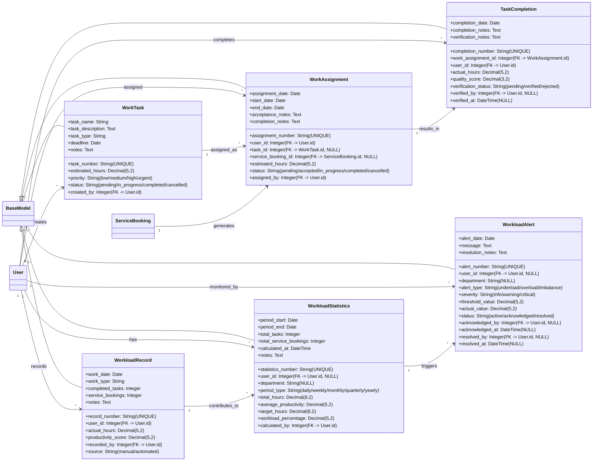

### 5. 食材与库存管理模块

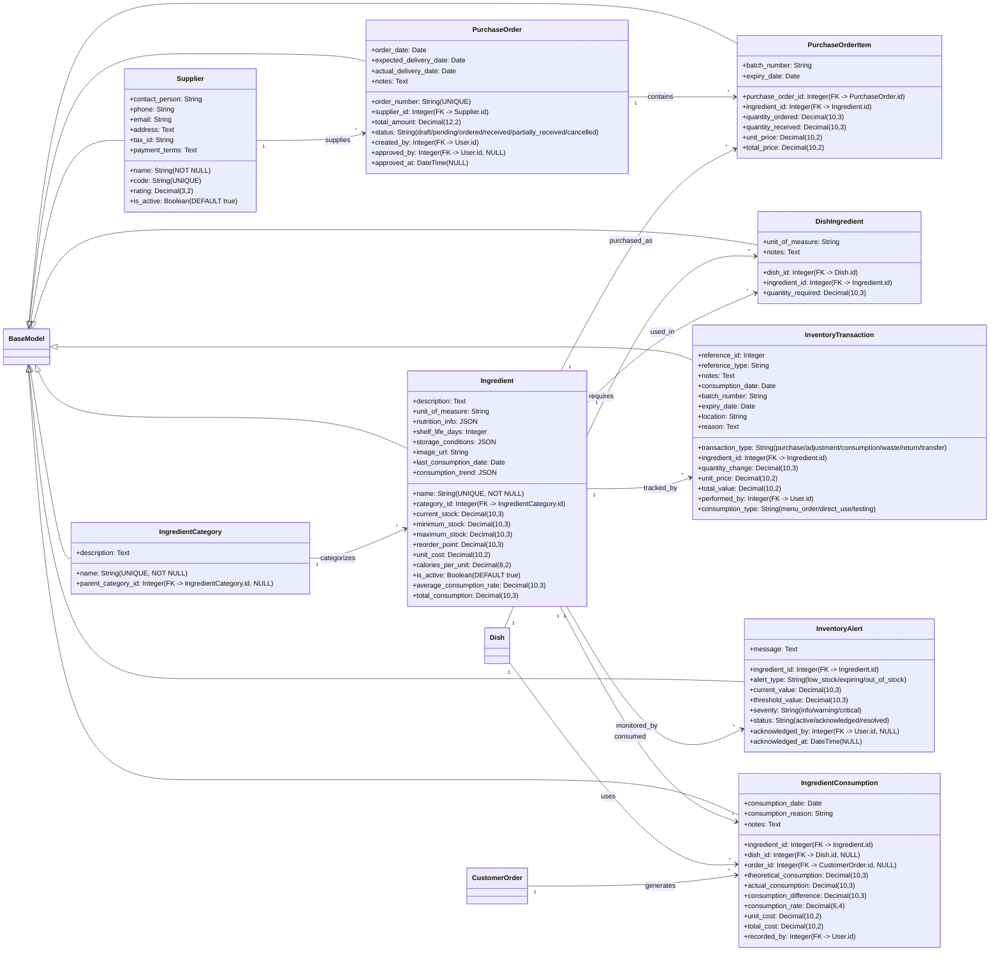

### 6. 服务管理模块（含母子服务）

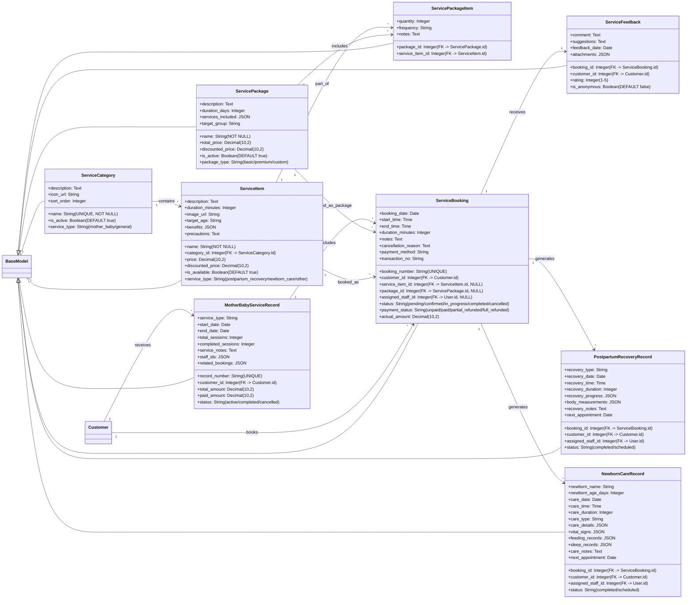

### 7. 配送与排餐模块

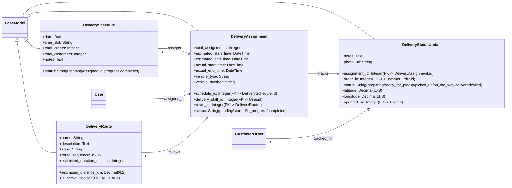

### 8. 月子餐管理模块

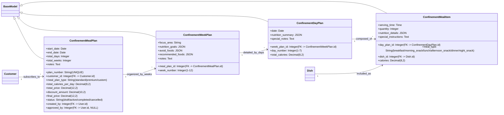

### 9. AI分析与报告模块

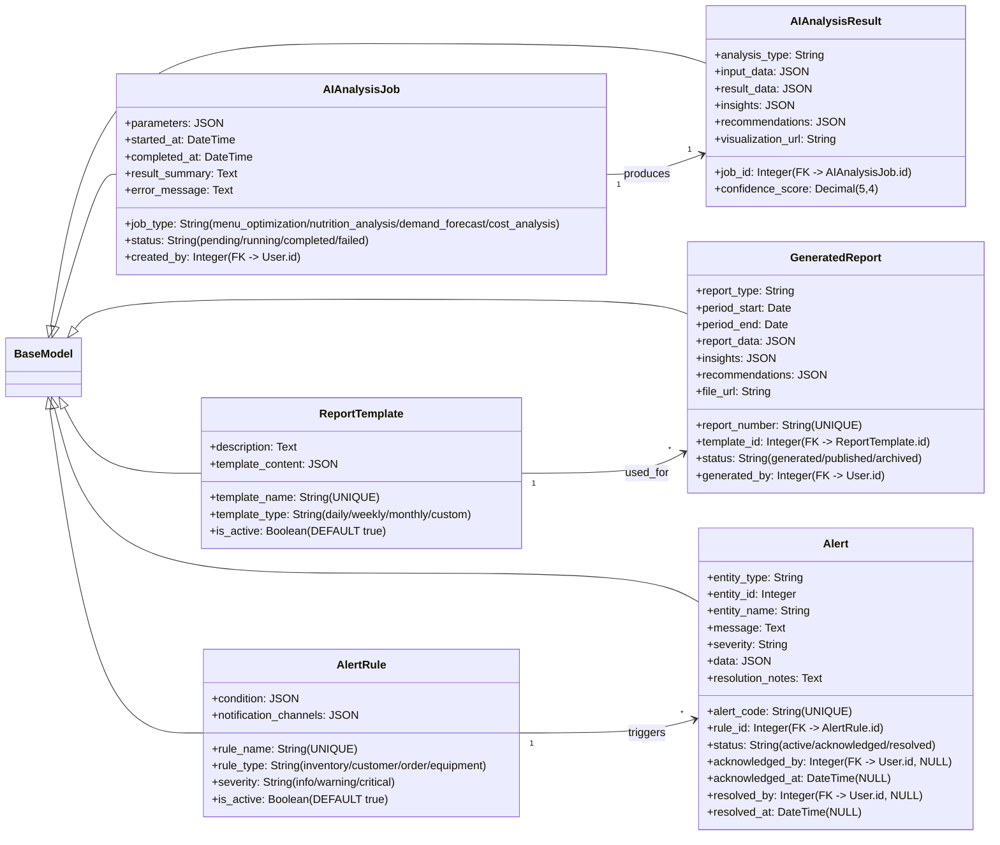

## 系统架构图

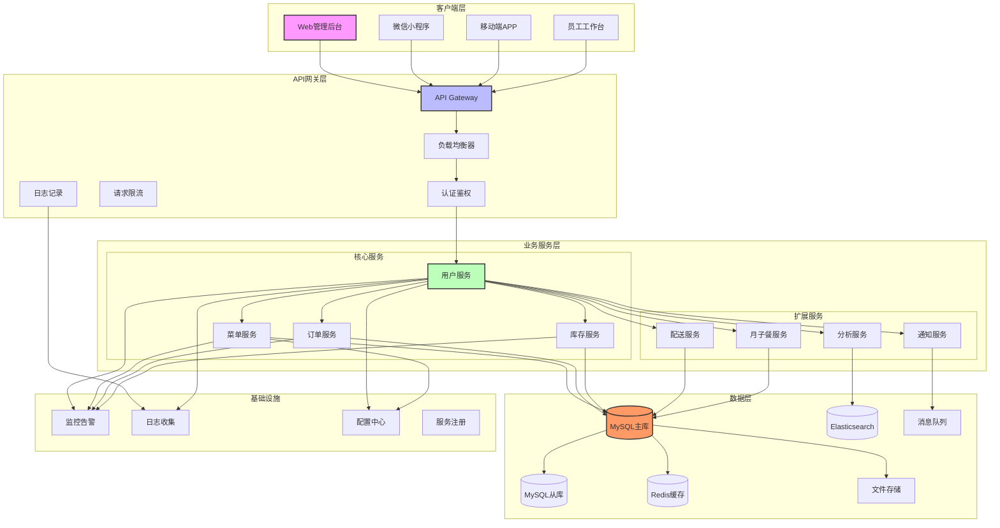

## 核心数据流图

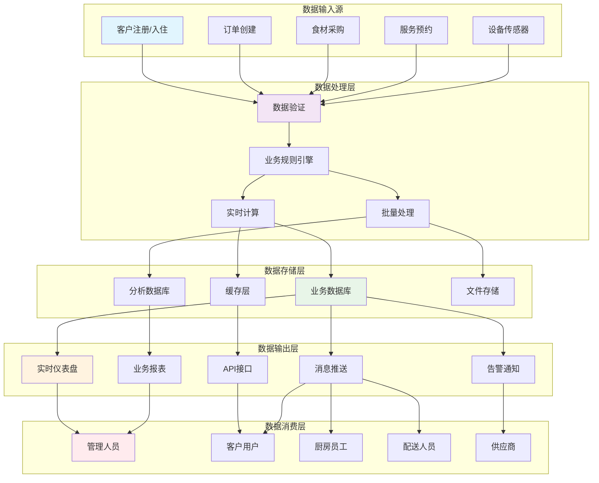

## 主要优化和改进

### 1. **数据结构优化**
- 统一了字段命名规范（snake_case）
- 添加了必要的索引字段（如唯一标识、外键）
- 使用JSON类型存储灵活数据结构
- 添加了软删除支持（deleted_at字段）

### 2. **关系规范化**
- 修正了外键关系，使用正确的符号表示
- 移除了冗余的BasicMenu表
- 优化了多对多关系的中间表设计
- 添加了级联操作说明

### 3. **业务完整性**
- 添加了状态字段跟踪业务流转
- 增加了审计字段（created_by, updated_by）
- 完善了数据验证约束（NOT NULL, UNIQUE）
- 添加了合理的默认值

### 4. **性能考虑**
- 为频繁查询的字段添加了索引
- 设计了合理的缓存策略
- 考虑了大表的分区策略
- 添加了归档和历史表的设计

### 5. **扩展性设计**
- 模块化设计，便于独立扩展
- 支持多种客户端接入
- 预留了AI分析和自动化接口
- 设计了灵活的通知和告警机制

## 订餐流程功能支持

### 涉及的表结构

#### 1. 订单管理相关表
- **Customer**：客户基本信息，作为订单的主关联表
- **CustomerOrder**：客户订单表，包含订单编号、客户ID、订单日期、配送日期、配送时间段、配送地址、联系人、联系电话、总金额、支付状态、订单状态等信息
- **OrderItem**：订单详情表，包含订单ID、菜品ID、数量、单价、总价、特殊说明、准备状态等信息

#### 2. 菜品管理相关表
- **Dish**：菜品信息表，包含菜品名称、描述、食材、饮食限制、卡路里、价格、准备时间、分类、图片等信息
- **MenuCategory**：菜单分类表，包含分类名称、描述、排序、状态等信息
- **DishIngredient**：菜品食材关联表，包含菜品ID、食材ID、所需数量、单位、备注等信息

#### 3. 库存管理相关表
- **Ingredient**：食材信息表，包含食材名称、描述、分类、单位、当前库存、最小库存、最大库存、重订点、单价、营养信息、保质期、存储条件等信息
- **IngredientCategory**：食材分类表，包含分类名称、描述、父分类等信息
- **InventoryTransaction**：库存交易记录表，包含交易类型、食材ID、数量变化、单价、总价、参考ID、参考类型、备注、执行人、消费类型、消费日期、批次号、过期日期、位置、原因等信息
- **InventoryAlert**：库存告警表，包含食材ID、告警类型、当前值、阈值、消息、严重程度、状态、确认人、确认时间等信息

#### 4. 配送管理相关表
- **DeliverySchedule**：配送计划表，包含日期、时间段、总订单数、总客户数、状态、备注等信息
- **DeliveryAssignment**：配送分配表，包含计划ID、配送员ID、路线ID、总分配数、预计开始时间、预计结束时间、实际开始时间、实际结束时间、车辆类型、车牌号、状态等信息
- **DeliveryRoute**：配送路线表，包含路线名称、描述、区域、路线顺序、预计距离、预计时长、状态等信息
- **DeliveryStatusUpdate**：配送状态更新表，包含分配ID、订单ID、状态、纬度、经度、备注、照片、更新人等信息

#### 5. 统计和提示相关表
- **AlertRule**：告警规则表，包含规则名称、规则类型、条件、严重程度、通知渠道、状态等信息
- **Alert**：告警表，包含告警代码、规则ID、实体类型、实体ID、实体名称、消息、严重程度、数据、状态、解决时间、解决人、解决备注、确认时间、确认人等信息

### 订餐流程数据流向

1. **订单创建数据流向**：
   - 客户通过系统下单，创建CustomerOrder记录
   - 为订单添加菜品，创建OrderItem记录
   - 订单关联到Customer表，获取客户信息
   - 订单关联到Dish表，获取菜品信息

2. **库存扣减数据流向**：
   - 根据订单中的菜品，通过DishIngredient表查询所需食材
   - 根据食材需求，通过InventoryTransaction表记录库存扣减
   - 更新Ingredient表的当前库存
   - 当库存低于阈值时，通过InventoryAlert表生成库存告警

3. **配送安排数据流向**：
   - 根据订单配送日期，创建DeliverySchedule记录
   - 为配送计划分配配送员，创建DeliveryAssignment记录
   - 为配送分配安排路线，关联DeliveryRoute表
   - 配送过程中更新状态，创建DeliveryStatusUpdate记录

4. **统计和提示数据流向**：
   - 从CustomerOrder和OrderItem表收集订单数据
   - 从InventoryTransaction表收集库存数据
   - 从DeliveryAssignment表收集配送数据
   - 根据AlertRule表的规则，生成Alert记录

### 订餐流程查询逻辑

1. **订单查询**：
   - 按客户ID和日期范围筛选CustomerOrder记录
   - 关联查询OrderItem和Dish表的详细信息
   - 支持按订单状态、支付状态、配送日期等条件进一步筛选
   - 支持排序和分页

2. **库存查询**：
   - 按食材ID和日期范围筛选InventoryTransaction记录
   - 关联查询Ingredient表的详细信息
   - 支持按交易类型、食材分类等条件进一步筛选
   - 支持排序和分页

3. **配送查询**：
   - 按日期范围筛选DeliverySchedule记录
   - 关联查询DeliveryAssignment、DeliveryRoute和DeliveryStatusUpdate的详细信息
   - 支持按配送状态、配送员、路线等条件进一步筛选
   - 支持排序和分页

4. **统计查询**：
   - 按客户、时间、菜品等维度统计订单数据
   - 按食材、时间等维度统计库存数据
   - 按配送员、时间等维度统计配送数据

### 订餐流程统计和提示机制

1. **订单统计**：
   - 订单总数、总金额、平均订单金额
   - 各菜品销量统计、各菜品收入统计
   - 各时间段订单分布、各区域订单分布
   - 订单状态分布、支付状态分布

2. **库存统计**：
   - 各食材库存水平、各食材消耗量
   - 各食材周转率、各食材缺货次数
   - 库存总价值、库存周转天数

3. **配送统计**：
   - 配送订单数、配送准时率、配送成功率
   - 各配送员工作量、各路线配送效率
   - 配送成本统计、客户满意度统计

4. **提示机制**：
   - 库存不足提示：当食材库存低于最小库存时，生成库存不足告警
   - 订单超时提示：当订单处理时间超过阈值时，生成订单超时告警
   - 配送延迟提示：当配送时间超过预计时间时，生成配送延迟告警
   - 食材过期提示：当食材接近保质期时，生成食材过期告警

### 订餐流程储备不足计算

1. **食材储备不足计算**：
   - 食材储备不足 = 最小库存 - 当前库存
   - 食材储备不足率 = （最小库存 - 当前库存）÷ 最小库存 × 100%
   - 食材储备不足等级：
     - 轻微不足：储备不足率 < 20%
     - 中度不足：20% ≤ 储备不足率 < 50%
     - 严重不足：储备不足率 ≥ 50%

2. **配送员储备不足计算**：
   - 人力资源需求 = 预计配送订单数 ÷ 人均配送效率
   - 工作量储备 = 现有配送员数量 × 人均可用工作时长 × 工作效率系数
   - 配送员储备不足 = 人力资源需求 - 工作量储备
   - 配送员储备不足率 = （人力资源需求 - 工作量储备）÷ 人力资源需求 × 100%

3. **订单处理储备不足计算**：
   - 订单处理需求 = 预计订单数 × 平均处理时间
   - 订单处理储备 = 可用处理人员数量 × 人均可用工作时长 × 工作效率系数
   - 订单处理储备不足 = 订单处理需求 - 订单处理储备
   - 订单处理储备不足率 = （订单处理需求 - 订单处理储备）÷ 订单处理需求 × 100%

### 订餐流程打印功能支持

1. **数据导出**：
   - 支持将订单查询结果导出为PDF、Excel等格式
   - 支持将库存查询结果导出为PDF、Excel等格式
   - 支持将配送查询结果导出为PDF、Excel等格式
   - 通过ReportTemplate和GeneratedReport表管理报表模板和生成记录

2. **报表格式**：
   - 订单报表：包含订单编号、客户姓名、订单日期、配送日期、配送地址、联系人、联系电话、订单状态、支付状态、订单金额、菜品明细等信息
   - 库存报表：包含食材名称、当前库存、最小库存、最大库存、重订点、单价、库存价值、库存状态等信息
   - 配送报表：包含配送日期、配送员、路线、订单数、客户数、配送状态、配送时间、配送距离等信息

3. **打印流程**：
   - 用户选择查询条件，获取查询结果
   - 选择报表模板和导出格式
   - 系统生成报表文件
   - 用户下载或直接打印报表

## 客户服务记录查询功能支持

### 涉及的表结构

#### 1. 服务记录查询相关表
- **Customer**：客户基本信息，作为服务记录的主关联表
- **ServiceBooking**：服务预约记录，包含服务类型、日期、时间、时长等信息
- **PostpartumRecoveryRecord**：产后恢复服务记录，包含详细的恢复情况
- **NewbornCareRecord**：新生儿护理服务记录，包含生命体征、喂养记录、睡眠记录等详细信息

#### 2. 餐食记录查询相关表
- **CustomerMenuSelection**：客户菜单选择记录，包含餐食类型、日期、菜品等信息
- **DailyMenu**：每日菜单，作为餐食选择的基础
- **Dish**：菜品信息，包含菜品名称、描述、营养信息等

#### 3. 孩子服务记录查询相关表
- **NewbornCareRecord**：新生儿护理服务记录，包含孩子的详细服务信息
- **ServiceBooking**：服务预约记录，关联到孩子服务

#### 4. 统计和提示相关表
- **WorkloadRecord**：工作量记录，用于统计服务人员工作量
- **WorkloadAlert**：工作量预警，用于提示储备不足情况
- **WorkloadStatistics**：工作量统计，用于多维度分析

### 数据流向

1. **服务记录数据流向**：
   - 客户通过ServiceBooking表预约服务
   - 服务执行后，生成PostpartumRecoveryRecord或NewbornCareRecord记录
   - 查询时，通过Customer关联ServiceBooking，再关联到具体的服务记录表

2. **餐食记录数据流向**：
   - 客户通过CustomerMenuSelection表选择每日餐食
   - 选择记录关联到DailyMenu和Dish表
   - 查询时，通过Customer关联CustomerMenuSelection，再关联到DailyMenu和Dish表

3. **孩子服务记录数据流向**：
   - 客户通过ServiceBooking表预约孩子服务
   - 服务执行后，生成NewbornCareRecord记录
   - 查询时，通过Customer关联ServiceBooking，再关联到NewbornCareRecord表

4. **统计和提示数据流向**：
   - 从ServiceBooking、PostpartumRecoveryRecord、NewbornCareRecord等表收集工作量数据
   - 存储到WorkloadRecord表
   - 计算生成WorkloadStatistics和WorkloadAlert记录

### 查询逻辑

1. **服务记录查询**：
   - 按客户ID和日期范围筛选ServiceBooking记录
   - 关联查询PostpartumRecoveryRecord和NewbornCareRecord的详细信息
   - 支持按服务类型、状态等条件进一步筛选

2. **餐食记录查询**：
   - 按客户ID和日期范围筛选CustomerMenuSelection记录
   - 关联查询Dish表的详细信息
   - 支持按餐食类型、菜品等条件进一步筛选

3. **孩子服务记录查询**：
   - 按客户ID和日期范围筛选ServiceBooking记录
   - 关联查询NewbornCareRecord的详细信息
   - 支持按服务类型、状态等条件进一步筛选

4. **统计查询**：
   - 按客户、服务类型、时间等维度统计服务数据
   - 按客户、餐食类型、时间等维度统计餐食数据
   - 按服务人员、时间等维度统计工作量数据

### 储备不足计算

1. **数据收集**：
   - 从ServiceBooking表获取服务预约数据
   - 从WorkloadRecord表获取工作量记录
   - 从User表获取可用服务人员数据

2. **计算逻辑**：
   - 人力资源需求 = Σ（服务预计工作量 ÷ 人均工作效率）
   - 工作量储备 = 现有员工数量 × 人均可用工作时长 × 工作效率系数
   - 储备不足率 = （人力资源需求 - 工作量储备）÷ 人力资源需求 × 100%

3. **预警机制**：
   - 当储备不足率超过阈值时，生成WorkloadAlert记录
   - 根据不足程度设置不同的预警级别
   - 通过系统通知、邮件等方式提醒相关人员

### 打印功能支持

1. **数据导出**：
   - 支持将查询结果导出为PDF、Excel等格式
   - 通过ReportTemplate和GeneratedReport表管理报表模板和生成记录

2. **报表格式**：
   - 服务记录报表：包含服务类型、日期、时间、时长、服务人员等信息
   - 餐食记录报表：包含餐食类型、日期、菜品、数量等信息
   - 孩子服务记录报表：包含服务类型、日期、时间、时长、生命体征等信息

3. **打印流程**：
   - 用户选择查询条件，获取查询结果
   - 选择报表模板和导出格式
   - 系统生成报表文件
   - 用户下载或直接打印报表

这个修正版数据库结构已经过优化，可以直接用于实际的系统开发。每个模块都有清晰的职责划分，表之间的关系也得到了正确的表达。建议在具体实施时，根据实际业务需求进行适当的调整和优化。