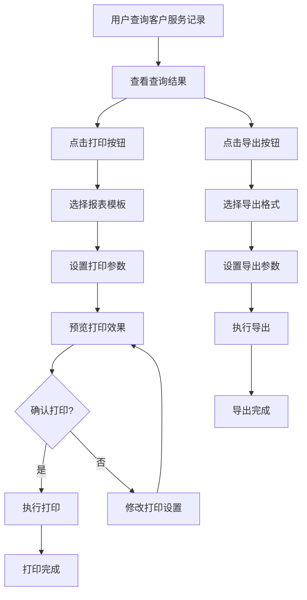

# 客户服务记录查询打印功能和报表格式设计

## 1. 打印功能设计

### 1.1 功能概述

#### 1.1.1 设计目标
- 提供客户服务记录查询结果的打印功能
- 支持多种报表格式和导出选项
- 确保打印内容的清晰、美观和完整
- 提供灵活的打印设置和预览功能

#### 1.1.2 核心功能
- **报表模板选择**：提供多种预设报表模板
- **打印预览**：在打印前预览报表效果
- **打印设置**：支持页面设置、打印机设置等
- **导出功能**：支持导出为PDF、Excel等格式
- **批量打印**：支持批量打印多条记录
- **自定义报表**：支持用户自定义报表格式

### 1.2 功能模块设计

#### 1.2.1 打印控制模块

| 功能 | 描述 | 实现方式 |
|------|------|----------|
| **打印触发** | 提供打印按钮，触发打印功能 | 前端按钮点击事件 |
| **报表选择** | 提供报表模板选择下拉框 | 前端下拉菜单 |
| **打印设置** | 提供页面设置、打印机设置等选项 | 前端设置面板 |
| **打印预览** | 生成打印预览，显示报表效果 | 前端预览组件 |
| **执行打印** | 发送打印命令到打印机 | 前端打印API |
| **导出功能** | 导出报表为PDF、Excel等格式 | 后端导出服务 |

#### 1.2.2 报表生成模块

| 功能 | 描述 | 实现方式 |
|------|------|----------|
| **数据获取** | 获取查询结果数据 | 后端API调用 |
| **数据处理** | 处理和格式化数据 | 后端数据处理 |
| **模板应用** | 应用选定的报表模板 | 模板引擎渲染 |
| **报表渲染** | 渲染报表内容 | 前端渲染组件 |
| **样式应用** | 应用报表样式 | CSS样式表 |
| **分页处理** | 处理报表分页 | 前端分页逻辑 |

#### 1.2.3 模板管理模块

| 功能 | 描述 | 实现方式 |
|------|------|----------|
| **模板存储** | 存储预设报表模板 | 数据库存储 |
| **模板编辑** | 提供模板编辑功能 | 前端编辑界面 |
| **模板预览** | 预览模板效果 | 前端预览组件 |
| **模板导入/导出** | 支持模板的导入和导出 | 前端文件上传/下载 |
| **模板分类** | 对模板进行分类管理 | 数据库分类字段 |

### 1.3 打印流程设计



### 1.4 技术实现

#### 1.4.1 前端实现

| 技术 | 用途 | 实现方式 |
|------|------|----------|
| **HTML/CSS** | 构建打印预览界面和报表样式 | 响应式CSS设计 |
| **JavaScript** | 实现打印控制和交互逻辑 | 事件处理、DOM操作 |
| **Print.js** | 提供打印功能 | 调用Print.js库 |
| **jsPDF** | 提供PDF导出功能 | 调用jsPDF库 |
| **SheetJS** | 提供Excel导出功能 | 调用SheetJS库 |
| **Vue.js/React** | 构建前端组件和状态管理 | 组件化开发 |

#### 1.4.2 后端实现

| 技术 | 用途 | 实现方式 |
|------|------|----------|
| **Flask/Django** | 提供后端API | RESTful API设计 |
| **Jinja2** | 提供报表模板渲染 | 模板引擎 |
| **WeasyPrint** | 提供HTML到PDF的转换 | 调用WeasyPrint库 |
| **OpenPyXL** | 提供Excel文件生成 | 调用OpenPyXL库 |
| **SQLAlchemy** | 提供数据库操作 | ORM映射 |

#### 1.4.3 数据库设计

| 表名 | 用途 | 字段设计 |
|------|------|----------|
| **ReportTemplate** | 存储报表模板 | id, name, type, content, description, created_at, updated_at |
| **PrintJob** | 存储打印任务记录 | id, user_id, report_type, print_date, status, parameters |
| **ExportJob** | 存储导出任务记录 | id, user_id, report_type, export_date, status, file_url, parameters |

### 1.5 性能优化

#### 1.5.1 前端优化

| 优化策略 | 描述 | 实现方式 |
|---------|------|----------|
| **延迟加载** | 延迟加载非关键资源 | 使用React.lazy或Vue的异步组件 |
| **数据分页** | 对大量数据进行分页处理 | 前端分页组件 |
| **缓存** | 缓存报表模板和数据 | 浏览器缓存 |
| **压缩** | 压缩CSS和JavaScript | 构建工具压缩 |

#### 1.5.2 后端优化

| 优化策略 | 描述 | 实现方式 |
|---------|------|----------|
| **数据缓存** | 缓存查询结果和报表数据 | Redis缓存 |
| **异步处理** | 异步处理打印和导出任务 | 后台任务队列 |
| **批量处理** | 批量处理数据 | 批量SQL查询 |
| **模板预编译** | 预编译报表模板 | 模板编译缓存 |

## 2. 报表格式设计

### 2.1 报表类型

#### 2.1.1 服务记录报表

| 报表名称 | 适用场景 | 内容要点 |
|---------|---------|----------|
| **服务记录明细表** | 详细查看客户服务记录 | 服务类型、日期、时间、时长、人员、状态等 |
| **服务记录汇总表** | 汇总分析客户服务情况 | 服务类型分布、时长统计、费用统计等 |
| **服务记录时间轴** | 按时间顺序查看服务记录 | 服务日期、时间、内容的时间轴展示 |
| **服务记录详情单** | 单个服务记录的详细信息 | 服务所有相关字段的详细信息 |

#### 2.1.2 餐食记录报表

| 报表名称 | 适用场景 | 内容要点 |
|---------|---------|----------|
| **餐食记录明细表** | 详细查看客户餐食记录 | 餐食类型、日期、菜品、状态等 |
| **餐食记录汇总表** | 汇总分析客户餐食情况 | 餐食类型分布、营养统计、费用统计等 |
| **餐食计划报表** | 查看客户餐食计划 | 每日餐食安排、菜品明细等 |
| **餐食记录详情单** | 单个餐食记录的详细信息 | 餐食所有相关字段的详细信息 |

#### 2.1.3 孩子服务记录报表

| 报表名称 | 适用场景 | 内容要点 |
|---------|---------|----------|
| **孩子服务记录明细表** | 详细查看孩子服务记录 | 服务类型、日期、时间、时长、人员等 |
| **孩子服务记录汇总表** | 汇总分析孩子服务情况 | 服务类型分布、时长统计等 |
| **孩子成长记录** | 记录孩子成长情况 | 生命体征、喂养记录、睡眠记录等 |
| **孩子服务详情单** | 单个孩子服务记录的详细信息 | 服务所有相关字段的详细信息 |

#### 2.1.4 综合报表

| 报表名称 | 适用场景 | 内容要点 |
|---------|---------|----------|
| **客户服务综合报表** | 综合查看客户所有服务记录 | 服务记录、餐食记录、孩子服务记录的综合展示 |
| **客户服务统计报表** | 统计分析客户服务情况 | 各项服务的统计数据和图表 |
| **客户服务趋势报表** | 分析客户服务趋势 | 服务数量、类型、费用的趋势分析 |
| **工作量储备不足报表** | 分析工作量储备不足情况 | 工作量负载率、储备不足率等统计数据 |

### 2.2 报表结构设计

#### 2.2.1 通用报表结构

| 部分 | 内容 | 设计要点 |
|------|------|----------|
| **表头** | 报表名称、公司logo、日期范围、生成日期等 | 居中显示，字体加粗 |
| **客户信息** | 客户姓名、ID、联系方式、入住日期等 | 左对齐，清晰排版 |
| **报表内容** | 详细数据表格或图表 | 表格边框清晰，数据对齐 |
| **统计信息** | 汇总数据、统计结果 | 字体加粗，突出显示 |
| **表尾** | 页码、备注、生成人等 | 右对齐，字体较小 |

#### 2.2.2 服务记录报表结构

| 部分 | 内容 | 设计要点 |
|------|------|----------|
| **表头** | 服务记录报表、日期范围、生成日期 | 居中显示，字体加粗 |
| **客户信息** | 客户姓名、ID、联系方式 | 左对齐，清晰排版 |
| **服务记录表格** | 服务日期、服务类型、服务名称、开始时间、结束时间、时长、服务人员、状态、备注 | 表格边框清晰，数据对齐，可排序 |
| **服务统计** | 服务总次数、总时长、总费用、各类型服务次数 | 字体加粗，突出显示 |
| **表尾** | 页码、生成人、生成时间 | 右对齐，字体较小 |

#### 2.2.3 餐食记录报表结构

| 部分 | 内容 | 设计要点 |
|------|------|----------|
| **表头** | 餐食记录报表、日期范围、生成日期 | 居中显示，字体加粗 |
| **客户信息** | 客户姓名、ID、联系方式、饮食限制 | 左对齐，清晰排版 |
| **餐食记录表格** | 日期、餐食类型、菜品名称、数量、状态、特殊说明 | 表格边框清晰，数据对齐，可排序 |
| **餐食统计** | 总餐次数、各类型餐食次数、营养摄入统计 | 字体加粗，突出显示 |
| **表尾** | 页码、生成人、生成时间 | 右对齐，字体较小 |

#### 2.2.4 孩子服务记录报表结构

| 部分 | 内容 | 设计要点 |
|------|------|----------|
| **表头** | 孩子服务记录报表、日期范围、生成日期 | 居中显示，字体加粗 |
| **客户信息** | 客户姓名、ID、联系方式、孩子姓名、孩子年龄 | 左对齐，清晰排版 |
| **服务记录表格** | 服务日期、服务类型、开始时间、结束时间、时长、服务人员、备注 | 表格边框清晰，数据对齐，可排序 |
| **生命体征统计** | 体温、心率、呼吸等生命体征的平均值和趋势 | 字体加粗，突出显示，可包含图表 |
| **喂养记录统计** | 喂养次数、喂养量、喂养间隔 | 字体加粗，突出显示 |
| **睡眠记录统计** | 睡眠时间、睡眠质量 | 字体加粗，突出显示 |
| **表尾** | 页码、生成人、生成时间 | 右对齐，字体较小 |

### 2.3 报表样式设计

#### 2.3.1 通用样式

| 样式元素 | 设计要点 | 实现方式 |
|---------|---------|----------|
| **字体** | 正文：12px Arial或SimSun，标题：14-16px Arial或SimHei | CSS字体设置 |
| **颜色** | 正文：#333333，标题：#000000，表格表头：#4A90E2，表格交替行：#F5F5F5 | CSS颜色设置 |
| **边框** | 表格边框：1px solid #DDDDDD，表头边框：2px solid #4A90E2 | CSS边框设置 |
| **间距** | 行高：1.2-1.5，单元格 padding：5-8px | CSS间距设置 |
| **对齐** | 文本：左对齐，数字：右对齐，标题：居中对齐 | CSS文本对齐 |
| **背景** | 表头背景：#F0F8FF，表格交替行背景：#F5F5F5 | CSS背景设置 |

#### 2.3.2 服务记录报表样式

| 样式元素 | 设计要点 | 实现方式 |
|---------|---------|----------|
| **服务类型列** | 根据服务类型显示不同颜色 | CSS条件样式 |
| **服务状态列** | 根据服务状态显示不同颜色 | CSS条件样式 |
| **时长列** | 右对齐，突出显示 | CSS文本对齐和字体加粗 |
| **统计信息** | 背景色：#E8F4F8，边框：1px solid #4A90E2 | CSS背景和边框设置 |

#### 2.3.3 餐食记录报表样式

| 样式元素 | 设计要点 | 实现方式 |
|---------|---------|----------|
| **餐食类型列** | 根据餐食类型显示不同颜色 | CSS条件样式 |
| **菜品名称列** | 左对齐，字体加粗 | CSS文本对齐和字体加粗 |
| **营养统计** | 使用图表展示营养摄入情况 | 嵌入式图表 |
| **统计信息** | 背景色：#F0F8E8，边框：1px solid #8BC34A | CSS背景和边框设置 |

#### 2.3.4 孩子服务记录报表样式

| 样式元素 | 设计要点 | 实现方式 |
|---------|---------|----------|
| **生命体征** | 使用折线图展示生命体征趋势 | 嵌入式图表 |
| **喂养记录** | 使用柱状图展示喂养情况 | 嵌入式图表 |
| **睡眠记录** | 使用饼图展示睡眠质量分布 | 嵌入式图表 |
| **统计信息** | 背景色：#FFF3E0，边框：1px solid #FF9800 | CSS背景和边框设置 |

### 2.4 报表模板设计

#### 2.4.1 服务记录报表模板

```html
<!DOCTYPE html>
<html>
<head>
    <meta charset="UTF-8">
    <title>服务记录报表</title>
    <style>
        body {
            font-family: Arial, SimSun, sans-serif;
            font-size: 12px;
            color: #333333;
        }
        .header {
            text-align: center;
            margin-bottom: 20px;
        }
        .header h1 {
            font-size: 16px;
            font-weight: bold;
            color: #000000;
        }
        .customer-info {
            margin-bottom: 20px;
            padding: 10px;
            border: 1px solid #DDDDDD;
            background-color: #F9F9F9;
        }
        .customer-info table {
            width: 100%;
            border-collapse: collapse;
        }
        .customer-info td {
            padding: 5px;
        }
        .service-table {
            width: 100%;
            border-collapse: collapse;
            margin-bottom: 20px;
        }
        .service-table th {
            background-color: #4A90E2;
            color: white;
            font-weight: bold;
            text-align: left;
            padding: 8px;
            border: 1px solid #DDDDDD;
        }
        .service-table td {
            padding: 8px;
            border: 1px solid #DDDDDD;
        }
        .service-table tr:nth-child(even) {
            background-color: #F5F5F5;
        }
        .statistics {
            margin-top: 20px;
            padding: 10px;
            border: 1px solid #4A90E2;
            background-color: #F0F8FF;
        }
        .statistics h3 {
            font-size: 14px;
            font-weight: bold;
            margin-bottom: 10px;
        }
        .statistics table {
            width: 100%;
            border-collapse: collapse;
        }
        .statistics td {
            padding: 5px;
            border: 1px solid #DDDDDD;
        }
        .footer {
            margin-top: 20px;
            text-align: right;
            font-size: 10px;
            color: #666666;
        }
    </style>
</head>
<body>
    <div class="header">
        <h1>服务记录报表</h1>
        <p>日期范围: {{ start_date }} 至 {{ end_date }}</p>
        <p>生成日期: {{ generate_date }}</p>
    </div>
    
    <div class="customer-info">
        <table>
            <tr>
                <td><strong>客户姓名:</strong> {{ customer.name }}</td>
                <td><strong>客户ID:</strong> {{ customer.id }}</td>
                <td><strong>联系方式:</strong> {{ customer.phone }}</td>
            </tr>
            <tr>
                <td><strong>入住日期:</strong> {{ customer.check_in_date }}</td>
                <td><strong>退房日期:</strong> {{ customer.check_out_date }}</td>
                <td><strong>状态:</strong> {{ customer.status }}</td>
            </tr>
        </table>
    </div>
    
    <table class="service-table">
        <thead>
            <tr>
                <th>服务日期</th>
                <th>服务类型</th>
                <th>服务名称</th>
                <th>开始时间</th>
                <th>结束时间</th>
                <th>时长(分钟)</th>
                <th>服务人员</th>
                <th>状态</th>
                <th>备注</th>
            </tr>
        </thead>
        <tbody>
            
            <tr>
                <td>{{ service.booking_date }}</td>
                <td>{{ service.service_type }}</td>
                <td>{{ service.service_name }}</td>
                <td>{{ service.start_time }}</td>
                <td>{{ service.end_time }}</td>
                <td>{{ service.duration_minutes }}</td>
                <td>{{ service.staff_name }}</td>
                <td>{{ service.status }}</td>
                <td>{{ service.notes }}</td>
            </tr>
            
        </tbody>
    </table>
    
    <div class="statistics">
        <h3>服务统计</h3>
        <table>
            <tr>
                <td><strong>服务总次数:</strong> {{ total_service_count }}</td>
                <td><strong>总时长(分钟):</strong> {{ total_duration }}</td>
                <td><strong>总费用(元):</strong> {{ total_amount }}</td>
            </tr>
            
            <tr>
                <td><strong>{{ type }}:</strong> {{ count }}次</td>
            </tr>
            
        </table>
    </div>
    
    <div class="footer">
        <p>页码: {{ page_number }} / {{ total_pages }}</p>
        <p>生成人: {{ generate_by }}</p>
        <p>备注: {{ remarks }}</p>
    </div>
</body>
</html>
```

#### 2.3.5 餐食记录报表模板

```html
<!DOCTYPE html>
<html>
<head>
    <meta charset="UTF-8">
    <title>餐食记录报表</title>
    <style>
        body {
            font-family: Arial, SimSun, sans-serif;
            font-size: 12px;
            color: #333333;
        }
        .header {
            text-align: center;
            margin-bottom: 20px;
        }
        .header h1 {
            font-size: 16px;
            font-weight: bold;
            color: #000000;
        }
        .customer-info {
            margin-bottom: 20px;
            padding: 10px;
            border: 1px solid #DDDDDD;
            background-color: #F9F9F9;
        }
        .customer-info table {
            width: 100%;
            border-collapse: collapse;
        }
        .customer-info td {
            padding: 5px;
        }
        .meal-table {
            width: 100%;
            border-collapse: collapse;
            margin-bottom: 20px;
        }
        .meal-table th {
            background-color: #8BC34A;
            color: white;
            font-weight: bold;
            text-align: left;
            padding: 8px;
            border: 1px solid #DDDDDD;
        }
        .meal-table td {
            padding: 8px;
            border: 1px solid #DDDDDD;
        }
        .meal-table tr:nth-child(even) {
            background-color: #F5F5F5;
        }
        .statistics {
            margin-top: 20px;
            padding: 10px;
            border: 1px solid #8BC34A;
            background-color: #F0F8E8;
        }
        .statistics h3 {
            font-size: 14px;
            font-weight: bold;
            margin-bottom: 10px;
        }
        .statistics table {
            width: 100%;
            border-collapse: collapse;
        }
        .statistics td {
            padding: 5px;
            border: 1px solid #DDDDDD;
        }
        .footer {
            margin-top: 20px;
            text-align: right;
            font-size: 10px;
            color: #666666;
        }
    </style>
</head>
<body>
    <div class="header">
        <h1>餐食记录报表</h1>
        <p>日期范围: {{ start_date }} 至 {{ end_date }}</p>
        <p>生成日期: {{ generate_date }}</p>
    </div>
    
    <div class="customer-info">
        <table>
            <tr>
                <td><strong>客户姓名:</strong> {{ customer.name }}</td>
                <td><strong>客户ID:</strong> {{ customer.id }}</td>
                <td><strong>联系方式:</strong> {{ customer.phone }}</td>
            </tr>
            <tr>
                <td><strong>饮食限制:</strong> {{ customer.dietary_restrictions }}</td>
                <td><strong>过敏史:</strong> {{ customer.allergies }}</td>
                <td><strong>偏好食物:</strong> {{ customer.preferred_foods }}</td>
            </tr>
        </table>
    </div>
    
    <table class="meal-table">
        <thead>
            <tr>
                <th>日期</th>
                <th>餐食类型</th>
                <th>菜品名称</th>
                <th>数量</th>
                <th>状态</th>
                <th>特殊说明</th>
            </tr>
        </thead>
        <tbody>
            
            <tr>
                <td>{{ meal.selection_date }}</td>
                <td>{{ meal.meal_type }}</td>
                <td>{{ meal.dish_name }}</td>
                <td>{{ meal.quantity }}</td>
                <td>{{ meal.status }}</td>
                <td>{{ meal.special_instructions }}</td>
            </tr>
            
        </tbody>
    </table>
    
    <div class="statistics">
        <h3>餐食统计</h3>
        <table>
            <tr>
                <td><strong>总餐次数:</strong> {{ total_meal_count }}</td>
                <td><strong>总费用(元):</strong> {{ total_amount }}</td>
            </tr>
            
            <tr>
                <td><strong>{{ type }}:</strong> {{ count }}次</td>
            </tr>
            
            
            <tr>
                <td><strong>营养摄入:</strong></td>
            </tr>
            
            <tr>
                <td><strong>{{ nutrient }}:</strong> {{ value }}</td>
            </tr>
            
            
        </table>
    </div>
    
    <div class="footer">
        <p>页码: {{ page_number }} / {{ total_pages }}</p>
        <p>生成人: {{ generate_by }}</p>
        <p>备注: {{ remarks }}</p>
    </div>
</body>
</html>
```

#### 2.3.6 孩子服务记录报表模板

```html
<!DOCTYPE html>
<html>
<head>
    <meta charset="UTF-8">
    <title>孩子服务记录报表</title>
    <style>
        body {
            font-family: Arial, SimSun, sans-serif;
            font-size: 12px;
            color: #333333;
        }
        .header {
            text-align: center;
            margin-bottom: 20px;
        }
        .header h1 {
            font-size: 16px;
            font-weight: bold;
            color: #000000;
        }
        .customer-info {
            margin-bottom: 20px;
            padding: 10px;
            border: 1px solid #DDDDDD;
            background-color: #F9F9F9;
        }
        .customer-info table {
            width: 100%;
            border-collapse: collapse;
        }
        .customer-info td {
            padding: 5px;
        }
        .child-service-table {
            width: 100%;
            border-collapse: collapse;
            margin-bottom: 20px;
        }
        .child-service-table th {
            background-color: #FF9800;
            color: white;
            font-weight: bold;
            text-align: left;
            padding: 8px;
            border: 1px solid #DDDDDD;
        }
        .child-service-table td {
            padding: 8px;
            border: 1px solid #DDDDDD;
        }
        .child-service-table tr:nth-child(even) {
            background-color: #F5F5F5;
        }
        .statistics {
            margin-top: 20px;
            padding: 10px;
            border: 1px solid #FF9800;
            background-color: #FFF3E0;
        }
        .statistics h3 {
            font-size: 14px;
            font-weight: bold;
            margin-bottom: 10px;
        }
        .statistics table {
            width: 100%;
            border-collapse: collapse;
        }
        .statistics td {
            padding: 5px;
            border: 1px solid #DDDDDD;
        }
        .footer {
            margin-top: 20px;
            text-align: right;
            font-size: 10px;
            color: #666666;
        }
    </style>
</head>
<body>
    <div class="header">
        <h1>孩子服务记录报表</h1>
        <p>日期范围: {{ start_date }} 至 {{ end_date }}</p>
        <p>生成日期: {{ generate_date }}</p>
    </div>
    
    <div class="customer-info">
        <table>
            <tr>
                <td><strong>客户姓名:</strong> {{ customer.name }}</td>
                <td><strong>客户ID:</strong> {{ customer.id }}</td>
                <td><strong>联系方式:</strong> {{ customer.phone }}</td>
            </tr>
            <tr>
                <td><strong>孩子姓名:</strong> {{ child.name }}</td>
                <td><strong>孩子年龄(天):</strong> {{ child.age_days }}</td>
                <td><strong>服务类型:</strong> {{ service_type }}</td>
            </tr>
        </table>
    </div>
    
    <table class="child-service-table">
        <thead>
            <tr>
                <th>服务日期</th>
                <th>服务类型</th>
                <th>开始时间</th>
                <th>结束时间</th>
                <th>时长(分钟)</th>
                <th>服务人员</th>
                <th>备注</th>
            </tr>
        </thead>
        <tbody>
            
            <tr>
                <td>{{ service.care_date }}</td>
                <td>{{ service.care_type }}</td>
                <td>{{ service.care_time }}</td>
                <td>{{ service.end_time }}</td>
                <td>{{ service.care_duration }}</td>
                <td>{{ service.staff_name }}</td>
                <td>{{ service.care_notes }}</td>
            </tr>
            
        </tbody>
    </table>
    
    <div class="statistics">
        <h3>服务统计</h3>
        <table>
            <tr>
                <td><strong>服务总次数:</strong> {{ total_service_count }}</td>
                <td><strong>总时长(分钟):</strong> {{ total_duration }}</td>
            </tr>
            
            <tr>
                <td><strong>{{ type }}:</strong> {{ count }}次</td>
            </tr>
            
        </table>
    </div>
    
    
    <div class="statistics">
        <h3>生命体征统计</h3>
        <table>
            
            <tr>
                <td><strong>{{ sign }}:</strong> {{ value }}</td>
            </tr>
            
        </table>
    </div>
    
    
    
    <div class="statistics">
        <h3>喂养记录统计</h3>
        <table>
            <tr>
                <td><strong>总喂养次数:</strong> {{ feeding_statistics.total_count }}</td>
                <td><strong>总喂养量:</strong> {{ feeding_statistics.total_amount }}</td>
                <td><strong>平均喂养间隔:</strong> {{ feeding_statistics.avg_interval }}小时</td>
            </tr>
        </table>
    </div>
    
    
    
    <div class="statistics">
        <h3>睡眠记录统计</h3>
        <table>
            <tr>
                <td><strong>总睡眠时间:</strong> {{ sleep_statistics.total_duration }}小时</td>
                <td><strong>平均睡眠时长:</strong> {{ sleep_statistics.avg_duration }}小时</td>
                <td><strong>睡眠质量:</strong> {{ sleep_statistics.quality }}</td>
            </tr>
        </table>
    </div>
    
    
    <div class="footer">
        <p>页码: {{ page_number }} / {{ total_pages }}</p>
        <p>生成人: {{ generate_by }}</p>
        <p>备注: {{ remarks }}</p>
    </div>
</body>
</html>
```

### 2.4 导出格式设计

#### 2.4.1 PDF格式

| 设计要点 | 实现方式 |
|---------|----------|
| **页面大小** | A4或自定义 |
| **页面方向** | 纵向或横向 |
| **边距** | 上：20mm，下：15mm，左：15mm，右：15mm |
| **字体** | 内嵌字体，确保跨设备显示一致 |
| **图片** | 压缩图片，确保PDF文件大小合理 |
| **安全性** | 可选加密和权限设置 |

#### 2.4.2 Excel格式

| 设计要点 | 实现方式 |
|---------|----------|
| **工作表** | 按数据类型分工作表 |
| **表头** | 冻结表头，方便浏览 |
| **格式** | 数字：右对齐，文本：左对齐，日期：日期格式 |
| **公式** | 包含必要的汇总公式 |
| **样式** | 应用单元格样式，提高可读性 |
| **图表** | 可选添加统计图表 |

#### 2.4.3 CSV格式

| 设计要点 | 实现方式 |
|---------|----------|
| **分隔符** | 逗号或分号 |
| **编码** | UTF-8，确保中文显示正确 |
| **表头** | 包含列名 |
| **数据** | 纯文本，不含格式 |
| **换行** | 标准换行符 |

### 2.5 报表生成示例

#### 2.5.1 服务记录报表生成示例

**请求参数**：
- 客户ID：1001
- 开始日期：2023-01-01
- 结束日期：2023-01-31
- 报表类型：service_detail
- 导出格式：pdf

**响应**：
- 生成PDF文件，包含客户1001在2023年1月的所有服务记录，包括服务日期、服务类型、服务名称、开始时间、结束时间、时长、服务人员、状态和备注等信息，以及服务统计数据。

#### 2.5.2 餐食记录报表生成示例

**请求参数**：
- 客户ID：1001
- 开始日期：2023-01-01
- 结束日期：2023-01-31
- 报表类型：meal_summary
- 导出格式：excel

**响应**：
- 生成Excel文件，包含客户1001在2023年1月的所有餐食记录，按餐食类型汇总，包含餐食类型、数量、营养摄入统计等信息。

#### 2.5.3 孩子服务记录报表生成示例

**请求参数**：
- 客户ID：1001
- 开始日期：2023-01-01
- 结束日期：2023-01-31
- 报表类型：child_service_detail
- 导出格式：pdf

**响应**：
- 生成PDF文件，包含客户1001的孩子在2023年1月的所有服务记录，包括服务日期、服务类型、开始时间、结束时间、时长、服务人员、备注等信息，以及生命体征、喂养记录、睡眠记录的统计数据。

## 3. 前端实现

### 3.1 打印功能实现

#### 3.1.1 打印按钮组件

```vue
<template>
  <div class="print-controls">
    <el-button type="primary" @click="showPrintDialog">
      <i class="el-icon-printer"></i> 打印
    </el-button>
    <el-button type="success" @click="showExportDialog">
      <i class="el-icon-download"></i> 导出
    </el-button>
    
    <!-- 打印对话框 -->
    <el-dialog
      title="打印设置"
      v-model="printDialogVisible"
      width="600px"
    >
      <el-form :model="printForm" label-width="80px">
        <el-form-item label="报表模板">
          <el-select v-model="printForm.template" placeholder="选择报表模板">
            <el-option
              v-for="template in templates"
              :key="template.id"
              :label="template.name"
              :value="template.id"
            ></el-option>
          </el-select>
        </el-form-item>
        <el-form-item label="日期范围">
          <el-date-picker
            v-model="printForm.dateRange"
            type="daterange"
            range-separator="至"
            start-placeholder="开始日期"
            end-placeholder="结束日期"
            format="yyyy-MM-dd"
            value-format="yyyy-MM-dd"
          ></el-date-picker>
        </el-form-item>
        <el-form-item label="页面设置">
          <el-select v-model="printForm.pageSize" placeholder="选择页面大小">
            <el-option label="A4" value="A4"></el-option>
            <el-option label="A3" value="A3"></el-option>
            <el-option label="自定义" value="custom"></el-option>
          </el-select>
        </el-form-item>
      </el-form>
      <template #footer>
        <span class="dialog-footer">
          <el-button @click="printDialogVisible = false">取消</el-button>
          <el-button type="primary" @click="previewReport">预览</el-button>
          <el-button type="success" @click="printReport">打印</el-button>
        </span>
      </template>
    </el-dialog>
    
    <!-- 导出对话框 -->
    <el-dialog
      title="导出设置"
      v-model="exportDialogVisible"
      width="600px"
    >
      <el-form :model="exportForm" label-width="80px">
        <el-form-item label="报表模板">
          <el-select v-model="exportForm.template" placeholder="选择报表模板">
            <el-option
              v-for="template in templates"
              :key="template.id"
              :label="template.name"
              :value="template.id"
            ></el-option>
          </el-select>
        </el-form-item>
        <el-form-item label="日期范围">
          <el-date-picker
            v-model="exportForm.dateRange"
            type="daterange"
            range-separator="至"
            start-placeholder="开始日期"
            end-placeholder="结束日期"
            format="yyyy-MM-dd"
            value-format="yyyy-MM-dd"
          ></el-date-picker>
        </el-form-item>
        <el-form-item label="导出格式">
          <el-select v-model="exportForm.format" placeholder="选择导出格式">
            <el-option label="PDF" value="pdf"></el-option>
            <el-option label="Excel" value="excel"></el-option>
            <el-option label="CSV" value="csv"></el-option>
          </el-select>
        </el-form-item>
      </el-form>
      <template #footer>
        <span class="dialog-footer">
          <el-button @click="exportDialogVisible = false">取消</el-button>
          <el-button type="primary" @click="exportReport">导出</el-button>
        </span>
      </template>
    </el-dialog>
    
    <!-- 预览对话框 -->
    <el-dialog
      title="报表预览"
      v-model="previewDialogVisible"
      width="800px"
      fullscreen
    >
      <div class="report-preview" ref="reportPreview">
        <!-- 预览内容将通过API获取并渲染 -->
        <div v-if="loading" class="loading">
          <el-icon class="is-loading"><i class="el-icon-loading"></i></el-icon> 加载中...
        </div>
        <div v-else v-html="previewContent"></div>
      </div>
      <template #footer>
        <span class="dialog-footer">
          <el-button @click="previewDialogVisible = false">关闭</el-button>
          <el-button type="primary" @click="printPreview">打印预览</el-button>
        </span>
      </template>
    </el-dialog>
  </div>
</template>

<script>
export default {
  data() {
    return {
      printDialogVisible: false,
      exportDialogVisible: false,
      previewDialogVisible: false,
      loading: false,
      previewContent: '',
      templates: [
        { id: 'service_detail', name: '服务记录明细表' },
        { id: 'service_summary', name: '服务记录汇总表' },
        { id: 'meal_detail', name: '餐食记录明细表' },
        { id: 'meal_summary', name: '餐食记录汇总表' },
        { id: 'child_service_detail', name: '孩子服务记录明细表' },
        { id: 'child_service_summary', name: '孩子服务记录汇总表' },
        { id: 'comprehensive', name: '客户服务综合报表' }
      ],
      printForm: {
        template: 'service_detail',
        dateRange: [new Date(), new Date()],
        pageSize: 'A4'
      },
      exportForm: {
        template: 'service_detail',
        dateRange: [new Date(), new Date()],
        format: 'pdf'
      }
    }
  },
  methods: {
    showPrintDialog() {
      this.printDialogVisible = true
    },
    showExportDialog() {
      this.exportDialogVisible = true
    },
    async previewReport() {
      this.loading = true
      try {
        const response = await this.$api.generateReport({
          template: this.printForm.template,
          startDate: this.printForm.dateRange[0],
          endDate: this.printForm.dateRange[1],
          format: 'html'
        })
        this.previewContent = response.data
        this.previewDialogVisible = true
      } catch (error) {
        this.$message.error('预览失败，请重试')
      } finally {
        this.loading = false
      }
    },
    async printReport() {
      try {
        const response = await this.$api.generateReport({
          template: this.printForm.template,
          startDate: this.printForm.dateRange[0],
          endDate: this.printForm.dateRange[1],
          format: 'pdf'
        })
        // 打开PDF文件进行打印
        window.open(response.data.fileUrl)
        this.printDialogVisible = false
      } catch (error) {
        this.$message.error('打印失败，请重试')
      }
    },
    async exportReport() {
      try {
        const response = await this.$api.exportReport({
          template: this.exportForm.template,
          startDate: this.exportForm.dateRange[0],
          endDate: this.exportForm.dateRange[1],
          format: this.exportForm.format
        })
        // 下载文件
        window.location.href = response.data.fileUrl
        this.exportDialogVisible = false
      } catch (error) {
        this.$message.error('导出失败，请重试')
      }
    },
    printPreview() {
      // 打印预览内容
      const printContent = this.$refs.reportPreview.innerHTML
      const printWindow = window.open('', '_blank')
      printWindow.document.write('<html><head><title>打印预览</title></head><body>' + printContent + '</body></html>')
      printWindow.document.close()
      printWindow.print()
    }
  }
}
</script>

<style scoped>
.print-controls {
  margin-bottom: 20px;
}
.report-preview {
  padding: 20px;
  background-color: white;
  min-height: 600px;
}
.loading {
  display: flex;
  justify-content: center;
  align-items: center;
  height: 400px;
  font-size: 16px;
  color: #666;
}
</style>
```

#### 3.1.2 打印预览组件

```vue
<template>
  <div class="report-preview">
    <div class="preview-header">
      <h2>{{ reportTitle }}</h2>
      <p>日期范围: {{ startDate }} 至 {{ endDate }}</p>
      <p>生成日期: {{ generateDate }}</p>
    </div>
    
    <div class="customer-info">
      <h3>客户信息</h3>
      <table>
        <tr>
          <td><strong>客户姓名:</strong> {{ customer.name }}</td>
          <td><strong>客户ID:</strong> {{ customer.id }}</td>
          <td><strong>联系方式:</strong> {{ customer.phone }}</td>
        </tr>
        <tr>
          <td><strong>入住日期:</strong> {{ customer.check_in_date }}</td>
          <td><strong>退房日期:</strong> {{ customer.check_out_date }}</td>
          <td><strong>状态:</strong> {{ customer.status }}</td>
        </tr>
      </table>
    </div>
    
    <div class="report-content">
      <h3>服务记录</h3>
      <el-table :data="services" style="width: 100%">
        <el-table-column prop="booking_date" label="服务日期" width="120"></el-table-column>
        <el-table-column prop="service_type" label="服务类型" width="100"></el-table-column>
        <el-table-column prop="service_name" label="服务名称" width="150"></el-table-column>
        <el-table-column prop="start_time" label="开始时间" width="100"></el-table-column>
        <el-table-column prop="end_time" label="结束时间" width="100"></el-table-column>
        <el-table-column prop="duration_minutes" label="时长(分钟)" width="100" align="right"></el-table-column>
        <el-table-column prop="staff_name" label="服务人员" width="120"></el-table-column>
        <el-table-column prop="status" label="状态" width="100"></el-table-column>
        <el-table-column prop="notes" label="备注"></el-table-column>
      </el-table>
    </div>
    
    <div class="report-statistics">
      <h3>服务统计</h3>
      <el-table :data="statistics" style="width: 100%">
        <el-table-column prop="name" label="统计项" width="150"></el-table-column>
        <el-table-column prop="value" label="值"></el-table-column>
      </el-table>
    </div>
    
    <div class="report-footer">
      <p>页码: {{ pageNumber }} / {{ totalPages }}</p>
      <p>生成人: {{ generateBy }}</p>
      <p>备注: {{ remarks }}</p>
    </div>
  </div>
</template>

<script>
export default {
  props: {
    reportTitle: {
      type: String,
      default: '服务记录报表'
    },
    startDate: {
      type: String,
      default: ''
    },
    endDate: {
      type: String,
      default: ''
    },
    generateDate: {
      type: String,
      default: ''
    },
    customer: {
      type: Object,
      default: () => ({})
    },
    services: {
      type: Array,
      default: () => []
    },
    statistics: {
      type: Array,
      default: () => []
    },
    pageNumber: {
      type: Number,
      default: 1
    },
    totalPages: {
      type: Number,
      default: 1
    },
    generateBy: {
      type: String,
      default: ''
    },
    remarks: {
      type: String,
      default: ''
    }
  }
}
</script>

<style scoped>
.report-preview {
  padding: 20px;
  background-color: white;
  font-family: Arial, SimSun, sans-serif;
  font-size: 12px;
  color: #333333;
}
.preview-header {
  text-align: center;
  margin-bottom: 20px;
}
.preview-header h2 {
  font-size: 16px;
  font-weight: bold;
  color: #000000;
}
.customer-info {
  margin-bottom: 20px;
  padding: 10px;
  border: 1px solid #DDDDDD;
  background-color: #F9F9F9;
}
.customer-info h3 {
  font-size: 14px;
  font-weight: bold;
  margin-bottom: 10px;
}
.customer-info table {
  width: 100%;
  border-collapse: collapse;
}
.customer-info td {
  padding: 5px;
}
.report-content {
  margin-bottom: 20px;
}
.report-content h3 {
  font-size: 14px;
  font-weight: bold;
  margin-bottom: 10px;
}
.report-statistics {
  margin-bottom: 20px;
  padding: 10px;
  border: 1px solid #4A90E2;
  background-color: #F0F8FF;
}
.report-statistics h3 {
  font-size: 14px;
  font-weight: bold;
  margin-bottom: 10px;
}
.report-footer {
  margin-top: 20px;
  text-align: right;
  font-size: 10px;
  color: #666666;
}
</style>
```

### 3.2 导出功能实现

#### 3.2.1 导出按钮组件

```vue
<template>
  <el-button type="success" @click="showExportDialog">
    <i class="el-icon-download"></i> 导出
  </el-button>
  
  <!-- 导出对话框 -->
  <el-dialog
    title="导出设置"
    v-model="dialogVisible"
    width="600px"
  >
    <el-form :model="exportForm" label-width="80px">
      <el-form-item label="报表模板">
        <el-select v-model="exportForm.template" placeholder="选择报表模板">
          <el-option
            v-for="template in templates"
            :key="template.id"
            :label="template.name"
            :value="template.id"
          ></el-option>
        </el-select>
      </el-form-item>
      <el-form-item label="日期范围">
        <el-date-picker
          v-model="exportForm.dateRange"
          type="daterange"
          range-separator="至"
          start-placeholder="开始日期"
          end-placeholder="结束日期"
          format="yyyy-MM-dd"
          value-format="yyyy-MM-dd"
        ></el-date-picker>
      </el-form-item>
      <el-form-item label="导出格式">
        <el-select v-model="exportForm.format" placeholder="选择导出格式">
          <el-option label="PDF" value="pdf"></el-option>
          <el-option label="Excel" value="excel"></el-option>
          <el-option label="CSV" value="csv"></el-option>
        </el-select>
      </el-form-item>
    </el-form>
    <template #footer>
      <span class="dialog-footer">
        <el-button @click="dialogVisible = false">取消</el-button>
        <el-button type="primary" @click="exportReport">导出</el-button>
      </span>
    </template>
  </el-dialog>
</template>

<script>
export default {
  data() {
    return {
      dialogVisible: false,
      templates: [
        { id: 'service_detail', name: '服务记录明细表' },
        { id: 'service_summary', name: '服务记录汇总表' },
        { id: 'meal_detail', name: '餐食记录明细表' },
        { id: 'meal_summary', name: '餐食记录汇总表' },
        { id: 'child_service_detail', name: '孩子服务记录明细表' },
        { id: 'child_service_summary', name: '孩子服务记录汇总表' },
        { id: 'comprehensive', name: '客户服务综合报表' }
      ],
      exportForm: {
        template: 'service_detail',
        dateRange: [new Date(), new Date()],
        format: 'pdf'
      }
    }
  },
  methods: {
    showExportDialog() {
      this.dialogVisible = true
    },
    async exportReport() {
      try {
        const response = await this.$api.exportReport({
          template: this.exportForm.template,
          startDate: this.exportForm.dateRange[0],
          endDate: this.exportForm.dateRange[1],
          format: this.exportForm.format
        })
        // 下载文件
        window.location.href = response.data.fileUrl
        this.dialogVisible = false
      } catch (error) {
        this.$message.error('导出失败，请重试')
      }
    }
  }
}
</script>
```

## 4. 后端实现

### 4.1 打印和导出API

#### 4.1.1 Flask API实现

```python
from flask import Flask, request, jsonify, send_file
from flask_restful import Api, Resource
import os
import tempfile
from datetime import datetime
from reportlab.lib.pagesizes import A4
from reportlab.lib.styles import getSampleStyleSheet, ParagraphStyle
from reportlab.platypus import SimpleDocTemplate, Paragraph, Table, TableStyle, Spacer
from reportlab.lib import colors
from reportlab.lib.units import cm
import pandas as pd
from io import BytesIO

app = Flask(__name__)
api = Api(app)

# 模拟数据
mock_customer = {
    "id": 1001,
    "name": "张三",
    "phone": "13800138000",
    "check_in_date": "2023-01-01",
    "check_out_date": "2023-01-31",
    "status": "active",
    "dietary_restrictions": "无辣",
    "allergies": "海鲜",
    "preferred_foods": "清淡"
}

mock_services = [
    {
        "booking_date": "2023-01-02",
        "service_type": "产后恢复",
        "service_name": "产后护理",
        "start_time": "09:00",
        "end_time": "10:00",
        "duration_minutes": 60,
        "staff_name": "李四",
        "status": "completed",
        "notes": "常规护理"
    },
    {
        "booking_date": "2023-01-03",
        "service_type": "新生儿护理",
        "service_name": "婴儿洗澡",
        "start_time": "14:00",
        "end_time": "14:30",
        "duration_minutes": 30,
        "staff_name": "王五",
        "status": "completed",
        "notes": "正常"
    },
    {
        "booking_date": "2023-01-04",
        "service_type": "产后恢复",
        "service_name": "产后按摩",
        "start_time": "10:00",
        "end_time": "11:00",
        "duration_minutes": 60,
        "staff_name": "李四",
        "status": "completed",
        "notes": "舒适"
    }
]

mock_meals = [
    {
        "selection_date": "2023-01-02",
        "meal_type": "早餐",
        "dish_name": "小米粥",
        "quantity": 1,
        "status": "delivered",
        "special_instructions": "无糖"
    },
    {
        "selection_date": "2023-01-02",
        "meal_type": "午餐",
        "dish_name": "清蒸鱼",
        "quantity": 1,
        "status": "delivered",
        "special_instructions": "无辣"
    },
    {
        "selection_date": "2023-01-02",
        "meal_type": "晚餐",
        "dish_name": "鸡汤",
        "quantity": 1,
        "status": "delivered",
        "special_instructions": "清淡"
    }
]

class ReportGenerator:
    @staticmethod
    def generate_service_report_pdf(customer, services, start_date, end_date):
        # 创建临时文件
        temp_file = tempfile.NamedTemporaryFile(suffix='.pdf', delete=False)
        
        # 创建PDF文档
        doc = SimpleDocTemplate(temp_file.name, pagesize=A4)
        elements = []
        styles = getSampleStyleSheet()
        
        # 表头
        title_style = ParagraphStyle('Title', parent=styles['Heading1'], alignment=1, fontSize=16)
        elements.append(Paragraph('服务记录报表', title_style))
        elements.append(Spacer(1, 12))
        
        # 日期范围
        date_style = ParagraphStyle('Date', parent=styles['Normal'], alignment=1)
        elements.append(Paragraph(f'日期范围: {start_date} 至 {end_date}', date_style))
        elements.append(Paragraph(f'生成日期: {datetime.now().strftime("%Y-%m-%d %H:%M:%S")}', date_style))
        elements.append(Spacer(1, 20))
        
        # 客户信息
        customer_info = [
            [Paragraph('<b>客户姓名:</b> ' + customer['name'], styles['Normal']), 
             Paragraph('<b>客户ID:</b> ' + str(customer['id']), styles['Normal']), 
             Paragraph('<b>联系方式:</b> ' + customer['phone'], styles['Normal'])],
            [Paragraph('<b>入住日期:</b> ' + customer['check_in_date'], styles['Normal']), 
             Paragraph('<b>退房日期:</b> ' + customer['check_out_date'], styles['Normal']), 
             Paragraph('<b>状态:</b> ' + customer['status'], styles['Normal'])]
        ]
        customer_table = Table(customer_info, colWidths=[10*cm, 6*cm, 6*cm])
        customer_table.setStyle(TableStyle([
            ('BACKGROUND', (0, 0), (-1, -1), colors.lightgrey),
            ('TEXTCOLOR', (0, 0), (-1, -1), colors.black),
            ('ALIGN', (0, 0), (-1, -1), 'LEFT'),
            ('FONTNAME', (0, 0), (-1, -1), 'Helvetica'),
            ('FONTSIZE', (0, 0), (-1, -1), 10),
            ('BOTTOMPADDING', (0, 0), (-1, -1), 12),
            ('GRID', (0, 0), (-1, -1), 1, colors.black)
        ]))
        elements.append(customer_table)
        elements.append(Spacer(1, 20))
        
        # 服务记录表格
        data = [['服务日期', '服务类型', '服务名称', '开始时间', '结束时间', '时长(分钟)', '服务人员', '状态', '备注']]
        for service in services:
            data.append([
                service['booking_date'],
                service['service_type'],
                service['service_name'],
                service['start_time'],
                service['end_time'],
                str(service['duration_minutes']),
                service['staff_name'],
                service['status'],
                service['notes']
            ])
        
        table = Table(data, colWidths=[2.5*cm, 2*cm, 3*cm, 2*cm, 2*cm, 2*cm, 2*cm, 2*cm, 3*cm])
        table.setStyle(TableStyle([
            ('BACKGROUND', (0, 0), (-1, 0), colors.HexColor('#4A90E2')),
            ('TEXTCOLOR', (0, 0), (-1, 0), colors.white),
            ('ALIGN', (0, 0), (-1, -1), 'LEFT'),
            ('FONTNAME', (0, 0), (-1, 0), 'Helvetica-Bold'),
            ('FONTSIZE', (0, 0), (-1, 0), 10),
            ('BOTTOMPADDING', (0, 0), (-1, 0), 12),
            ('BACKGROUND', (0, 1), (-1, -1), colors.white),
            ('TEXTCOLOR', (0, 1), (-1, -1), colors.black),
            ('FONTNAME', (0, 1), (-1, -1), 'Helvetica'),
            ('FONTSIZE', (0, 1), (-1, -1), 10),
            ('BOTTOMPADDING', (0, 1), (-1, -1), 8),
            ('GRID', (0, 0), (-1, -1), 1, colors.black)
        ]))
        elements.append(table)
        elements.append(Spacer(1, 20))
        
        # 统计信息
        total_services = len(services)
        total_duration = sum(service['duration_minutes'] for service in services)
        
        stats_data = [
            ['服务总次数:', str(total_services)],
            ['总时长(分钟):', str(total_duration)]
        ]
        
        stats_table = Table(stats_data, colWidths=[8*cm, 10*cm])
        stats_table.setStyle(TableStyle([
            ('BACKGROUND', (0, 0), (-1, -1), colors.lightgrey),
            ('TEXTCOLOR', (0, 0), (-1, -1), colors.black),
            ('ALIGN', (0, 0), (0, -1), 'LEFT'),
            ('ALIGN', (1, 0), (1, -1), 'LEFT'),
            ('FONTNAME', (0, 0), (-1, -1), 'Helvetica'),
            ('FONTSIZE', (0, 0), (-1, -1), 10),
            ('BOTTOMPADDING', (0, 0), (-1, -1), 8),
            ('GRID', (0, 0), (-1, -1), 1, colors.black)
        ]))
        elements.append(Paragraph('<b>服务统计</b>', styles['Heading2']))
        elements.append(stats_table)
        elements.append(Spacer(1, 20))
        
        # 表尾
        footer_style = ParagraphStyle('Footer', parent=styles['Normal'], alignment=2, fontSize=10, textColor=colors.grey)
        elements.append(Paragraph('页码: 1 / 1', footer_style))
        elements.append(Paragraph('生成人: 系统', footer_style))
        
        # 生成PDF
        doc.build(elements)
        
        return temp_file.name
    
    @staticmethod
    def generate_service_report_excel(customer, services, start_date, end_date):
        # 创建Excel文件
        output = BytesIO()
        with pd.ExcelWriter(output, engine='openpyxl') as writer:
            # 服务记录工作表
            service_data = []
            for service in services:
                service_data.append({
                    '服务日期': service['booking_date'],
                    '服务类型': service['service_type'],
                    '服务名称': service['service_name'],
