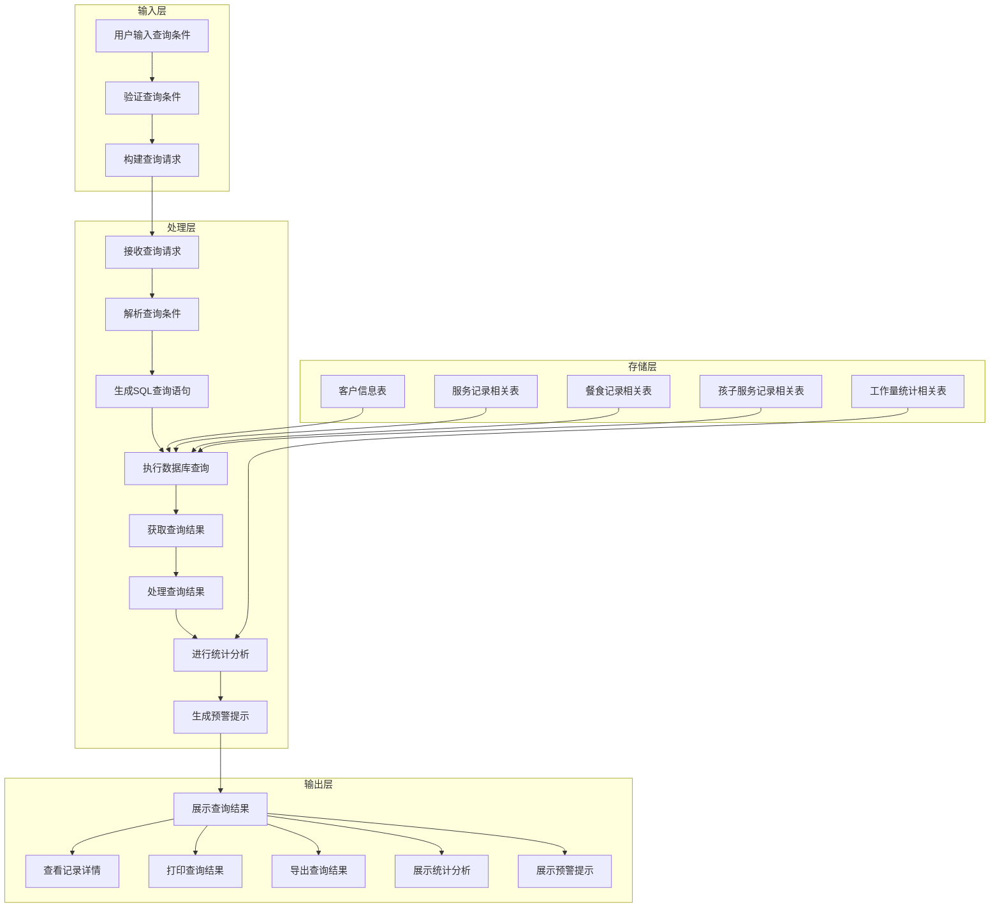
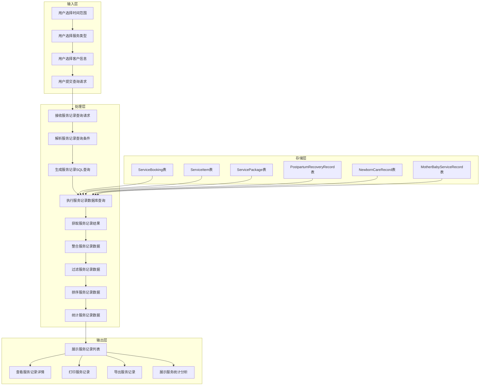
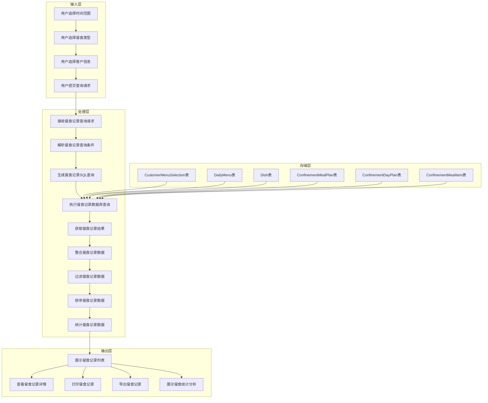
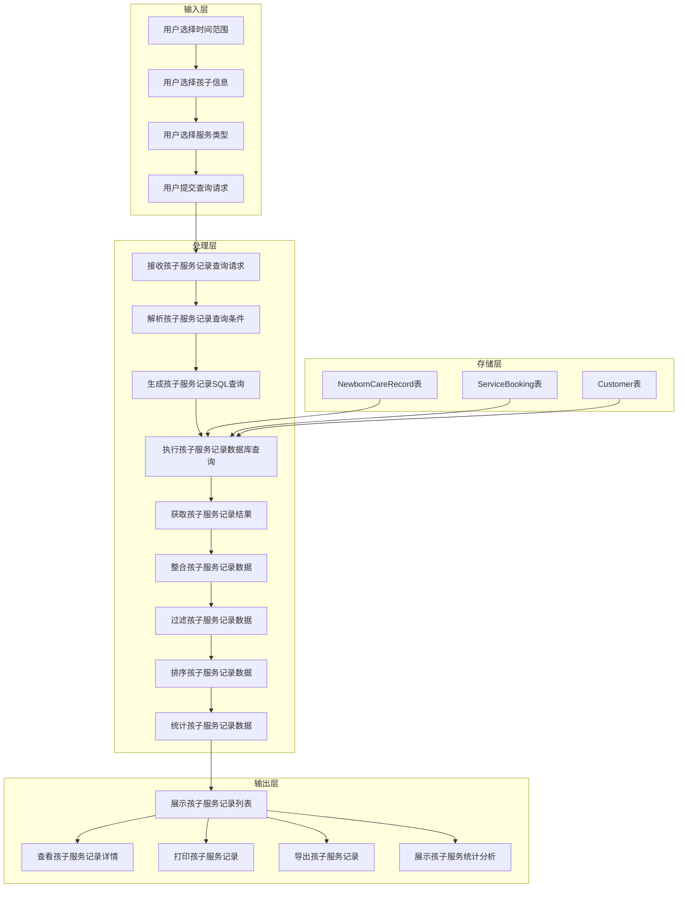

# 客户服务记录查询数据流和查询逻辑分析

## 1. 数据流分析

### 1.1 整体数据流

### 1.2 服务记录数据流

### 1.3 餐食记录数据流

### 1.4 孩子服务记录数据流

## 2. 查询逻辑分析

### 2.1 服务记录查询逻辑

#### 2.1.1 基本查询逻辑

1. **查询条件处理**：
   - 时间范围：开始日期和结束日期
   - 客户信息：客户ID、姓名、电话等
   - 服务类型：服务项目ID、服务套餐ID等
   - 服务状态：pending、confirmed、completed等
   - 服务人员：分配的员工ID

2. **SQL查询构建**：
   - 主表：ServiceBooking
   - 关联表：ServiceItem、ServicePackage、User
   - 条件：根据查询条件构建WHERE子句
   - 排序：按预约日期和开始时间降序排序

3. **数据整合**：
   - 合并ServiceBooking、ServiceItem、ServicePackage的数据
   - 处理服务项目和服务套餐的显示逻辑
   - 处理服务状态的显示逻辑

4. **结果展示**：
   - 列表展示：预约编号、客户姓名、服务名称、预约日期、开始时间、结束时间、服务状态、服务人员
   - 详情展示：包含所有服务相关字段的详细信息

#### 2.1.2 高级查询逻辑

1. **服务记录与产后恢复记录关联**：
   - 关联ServiceBooking和PostpartumRecoveryRecord
   - 显示产后恢复服务的详细信息

2. **服务记录与新生儿护理记录关联**：
   - 关联ServiceBooking和NewbornCareRecord
   - 显示新生儿护理服务的详细信息

3. **服务记录与母子服务记录关联**：
   - 关联ServiceBooking和MotherBabyServiceRecord
   - 显示母子服务的详细信息

### 2.2 餐食记录查询逻辑

#### 2.2.1 基本查询逻辑

1. **查询条件处理**：
   - 时间范围：开始日期和结束日期
   - 客户信息：客户ID、姓名、电话等
   - 餐食类型：早餐、午餐、晚餐、加餐等
   - 餐食状态：pending、confirmed、prepared、delivered等

2. **SQL查询构建**：
   - 主表：CustomerMenuSelection
   - 关联表：DailyMenu、Dish
   - 条件：根据查询条件构建WHERE子句
   - 排序：按选择日期和餐食类型排序

3. **数据整合**：
   - 合并CustomerMenuSelection、DailyMenu、Dish的数据
   - 处理餐食状态的显示逻辑
   - 处理餐食类型的显示逻辑

4. **结果展示**：
   - 列表展示：选择日期、餐食类型、菜品名称、数量、特殊说明、餐食状态
   - 详情展示：包含所有餐食相关字段的详细信息

#### 2.2.2 高级查询逻辑

1. **餐食记录与月子餐计划关联**：
   - 关联CustomerMenuSelection和ConfinementMealPlan
   - 显示月子餐计划的详细信息

2. **餐食记录与菜品详情关联**：
   - 关联CustomerMenuSelection和Dish
   - 显示菜品的详细信息，包括食材、卡路里等

3. **餐食记录与每日菜单关联**：
   - 关联CustomerMenuSelection和DailyMenu
   - 显示每日菜单的详细信息

### 2.3 孩子服务记录查询逻辑

#### 2.3.1 基本查询逻辑

1. **查询条件处理**：
   - 时间范围：开始日期和结束日期
   - 客户信息：客户ID、姓名、电话等
   - 孩子信息：新生儿姓名、年龄等
   - 服务类型：护理类型等

2. **SQL查询构建**：
   - 主表：NewbornCareRecord
   - 关联表：ServiceBooking、Customer
   - 条件：根据查询条件构建WHERE子句
   - 排序：按护理日期和护理时间降序排序

3. **数据整合**：
   - 合并NewbornCareRecord、ServiceBooking、Customer的数据
   - 处理护理类型的显示逻辑
   - 处理生命体征、喂养记录、睡眠记录的显示逻辑

4. **结果展示**：
   - 列表展示：新生儿姓名、护理日期、护理时间、护理类型、护理时长、服务人员
   - 详情展示：包含所有孩子服务相关字段的详细信息

#### 2.3.2 高级查询逻辑

1. **孩子服务记录与服务预约关联**：
   - 关联NewbornCareRecord和ServiceBooking
   - 显示服务预约的详细信息

2. **孩子服务记录与服务人员关联**：
   - 关联NewbornCareRecord和User
   - 显示服务人员的详细信息

3. **孩子服务记录的生命体征趋势分析**：
   - 提取生命体征数据
   - 生成生命体征趋势图表

### 2.4 工作量储备不足查询逻辑

#### 2.4.1 基本查询逻辑

1. **查询条件处理**：
   - 时间范围：开始日期和结束日期
   - 部门：可选特定部门
   - 员工：可选特定员工

2. **SQL查询构建**：
   - 主表：WorkloadRecord、WorkloadStatistics、WorkloadAlert
   - 关联表：User、WorkAssignment
   - 条件：根据查询条件构建WHERE子句
   - 排序：按工作日期降序排序

3. **数据整合**：
   - 合并WorkloadRecord、WorkloadStatistics、WorkloadAlert的数据
   - 处理工作量类型的显示逻辑
   - 处理预警级别的显示逻辑

4. **结果展示**：
   - 列表展示：工作日期、员工姓名、工作类型、实际工时、工作量状态、预警级别
   - 详情展示：包含所有工作量相关字段的详细信息

#### 2.4.2 高级查询逻辑

1. **工作量储备不足计算**：
   - 计算人力资源需求
   - 计算工作量储备
   - 计算工作量储备不足
   - 计算工作负载率

2. **工作量储备不足预警**：
   - 根据计算结果生成预警
   - 显示预警级别和消息
   - 提供预警处理建议

## 3. 数据查询优化

### 3.1 数据库索引优化

1. **服务记录查询索引**：
   - 在ServiceBooking表的customer_id、booking_date、status字段上创建索引
   - 在PostpartumRecoveryRecord表的customer_id、recovery_date字段上创建索引
   - 在NewbornCareRecord表的customer_id、care_date字段上创建索引

2. **餐食记录查询索引**：
   - 在CustomerMenuSelection表的customer_id、selection_date、meal_type字段上创建索引
   - 在DailyMenu表的date字段上创建索引
   - 在ConfinementMealPlan表的customer_id、start_date、end_date字段上创建索引

3. **工作量统计查询索引**：
   - 在WorkloadRecord表的user_id、work_date字段上创建索引
   - 在WorkloadStatistics表的user_id、period_start、period_end字段上创建索引
   - 在WorkloadAlert表的user_id、alert_date字段上创建索引

### 3.2 查询语句优化

1. **避免全表扫描**：
   - 使用WHERE子句过滤数据
   - 使用索引字段进行查询
   - 避免使用SELECT *

2. **优化JOIN操作**：
   - 只关联必要的表
   - 使用INNER JOIN替代OUTER JOIN
   - 合理安排JOIN顺序

3. **优化排序操作**：
   - 使用索引字段进行排序
   - 限制排序的结果集大小
   - 使用分页减少排序的数据量

4. **优化统计操作**：
   - 使用聚合函数进行统计
   - 考虑使用物化视图缓存统计结果
   - 定期更新统计数据

### 3.3 缓存策略优化

1. **查询结果缓存**：
   - 缓存频繁查询的结果
   - 设置合理的缓存过期时间
   - 使用缓存键包含查询条件

2. **数据预加载**：
   - 预加载常用的关联数据
   - 使用批量加载减少数据库查询次数
   - 考虑使用异步加载处理大量数据

3. **缓存失效策略**：
   - 数据更新时及时失效缓存
   - 使用事件触发缓存更新
   - 定期清理过期缓存

## 4. 查询性能测试

### 4.1 测试场景

1. **服务记录查询测试**：
   - 测试不同时间范围的查询性能
   - 测试不同客户数量的查询性能
   - 测试不同服务类型的查询性能

2. **餐食记录查询测试**：
   - 测试不同时间范围的查询性能
   - 测试不同客户数量的查询性能
   - 测试不同餐食类型的查询性能

3. **孩子服务记录查询测试**：
   - 测试不同时间范围的查询性能
   - 测试不同客户数量的查询性能
   - 测试不同孩子数量的查询性能

4. **工作量储备不足查询测试**：
   - 测试不同时间范围的查询性能
   - 测试不同员工数量的查询性能
   - 测试不同部门的查询性能

### 4.2 测试指标

1. **响应时间**：
   - 查询开始到结果展示的时间
   - 不同数据量下的响应时间
   - 不同查询条件下的响应时间

2. **查询执行时间**：
   - SQL查询执行的时间
   - 数据处理的时间
   - 结果返回的时间

3. **资源消耗**：
   - CPU使用率
   - 内存使用率
   - 数据库连接数

4. **并发性能**：
   - 不同并发用户数下的性能
   - 并发查询的响应时间
   - 并发查询的成功率

### 4.3 测试结果分析

1. **性能瓶颈识别**：
   - 识别查询中的性能瓶颈
   - 分析瓶颈产生的原因
   - 提出优化建议

2. **优化效果评估**：
   - 评估索引优化的效果
   - 评估查询语句优化的效果
   - 评估缓存策略优化的效果

3. **最佳实践总结**：
   - 总结查询性能优化的最佳实践
   - 提出查询设计的建议
   - 制定查询性能监控方案

## 5. 数据安全考虑

### 5.1 访问控制

1. **用户权限管理**：
   - 基于角色的访问控制
   - 基于数据的访问控制
   - 基于操作的访问控制

2. **查询权限限制**：
   - 限制用户只能查询有权限的客户数据
   - 限制用户只能查询有权限的服务数据
   - 限制用户只能查询有权限的餐食数据

### 5.2 数据加密

1. **传输加密**：
   - 使用HTTPS加密传输查询请求和结果
   - 使用TLS加密数据库连接

2. **存储加密**：
   - 加密敏感客户信息
   - 加密敏感服务记录
   - 加密敏感餐食记录

### 5.3 审计日志

1. **查询操作日志**：
   - 记录所有查询操作
   - 记录查询条件和结果
   - 记录查询用户和时间

2. **数据访问日志**：
   - 记录所有数据访问操作
   - 记录访问的数据表和字段
   - 记录访问用户和时间

## 6. 总结

本分析文档详细描述了客户服务记录查询的数据流和查询逻辑，包括整体数据流、服务记录数据流、餐食记录数据流和孩子服务记录数据流。同时，文档还分析了服务记录查询逻辑、餐食记录查询逻辑、孩子服务记录查询逻辑和工作量储备不足查询逻辑，并提供了数据查询优化、查询性能测试和数据安全考虑的建议。

通过合理设计数据流和查询逻辑，可以提高客户服务记录查询的效率和准确性，为客户提供更好的服务体验。同时，通过优化查询性能和加强数据安全，可以确保系统的稳定性和安全性。