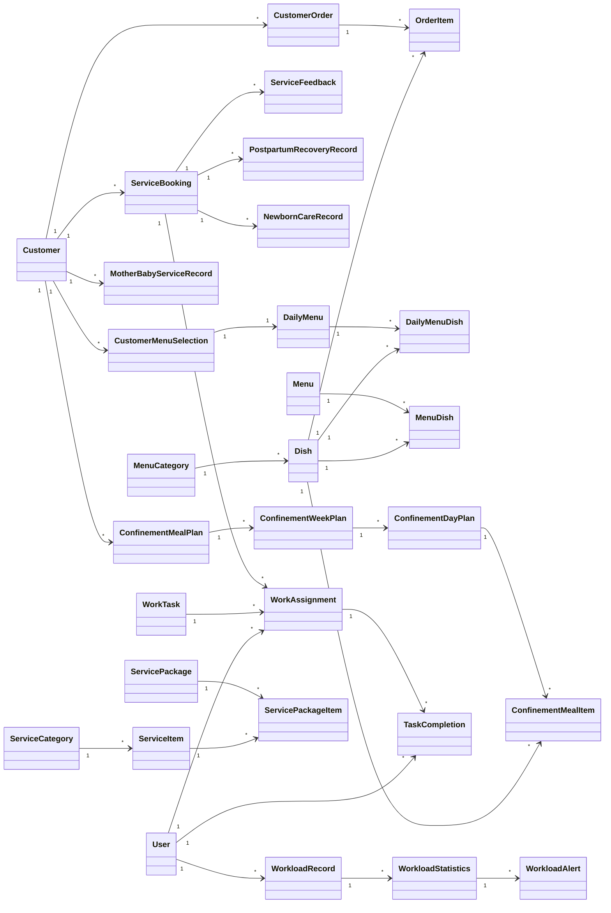

# 客户服务记录查询涉及的数据库表结构

## 1. 客户管理模块

### 1.1 Customer（客户基本信息表）
- **id**：客户ID（主键）
- **name**：客户姓名（非空）
- **email**：客户邮箱（唯一）
- **phone**：客户电话
- **date_of_birth**：出生日期
- **gender**：性别
- **height_cm**：身高（厘米）
- **weight_kg**：体重（公斤）
- **check_in_date**：入住日期
- **check_out_date**：退房日期
- **id_card_number**：身份证号
- **id_card_image_url**：身份证图片URL
- **physical_exam_report_url**：体检报告URL
- **health_conditions**：健康状况（JSON）
- **dietary_restrictions**：饮食限制（JSON）
- **allergies**：过敏史（JSON）
- **preferred_foods**：偏好食物（JSON）
- **meal_plan_type**：餐食计划类型
- **status**：状态（active/inactive/archived）
- **created_at**：创建时间
- **updated_at**：更新时间
- **deleted_at**：删除时间（软删除）
- **version**：版本号

### 1.2 CustomerDietaryPreference（客户饮食偏好表）
- **id**：偏好ID（主键）
- **customer_id**：客户ID（外键，关联Customer.id）
- **preference_type**：偏好类型
- **preference_value**：偏好值
- **severity**：严重程度（low/medium/high）
- **notes**：备注
- **created_at**：创建时间
- **updated_at**：更新时间
- **deleted_at**：删除时间（软删除）
- **version**：版本号

### 1.3 CustomerMenuSelection（客户菜单选择表）
- **id**：选择ID（主键）
- **customer_id**：客户ID（外键，关联Customer.id）
- **daily_menu_id**：每日菜单ID（外键，关联DailyMenu.id）
- **selection_date**：选择日期
- **meal_type**：餐食类型
- **dish_id**：菜品ID（外键，关联Dish.id）
- **quantity**：数量
- **special_instructions**：特殊说明
- **status**：状态（pending/confirmed/prepared/delivered）
- **created_at**：创建时间
- **updated_at**：更新时间
- **deleted_at**：删除时间（软删除）
- **version**：版本号

### 1.4 CustomerOrder（客户订单表）
- **id**：订单ID（主键）
- **order_number**：订单编号（唯一）
- **customer_id**：客户ID（外键，关联Customer.id）
- **order_date**：订单日期
- **delivery_date**：配送日期
- **delivery_time_slot**：配送时间段
- **delivery_address**：配送地址
- **contact_person**：联系人
- **contact_phone**：联系电话
- **total_items**：总项目数
- **subtotal_amount**：小计金额
- **tax_amount**：税费金额
- **delivery_fee**：配送费
- **total_amount**：总金额
- **payment_method**：支付方式
- **payment_status**：支付状态（pending/paid/refunded）
- **order_status**：订单状态（pending/confirmed/preparing/ready/delivered/completed/cancelled）
- **notes**：备注
- **created_at**：创建时间
- **updated_at**：更新时间
- **deleted_at**：删除时间（软删除）
- **version**：版本号

### 1.5 OrderItem（订单项目表）
- **id**：项目ID（主键）
- **order_id**：订单ID（外键，关联CustomerOrder.id）
- **dish_id**：菜品ID（外键，关联Dish.id）
- **quantity**：数量
- **unit_price**：单价
- **total_price**：总价
- **special_instructions**：特殊说明
- **preparation_status**：准备状态（pending/in_progress/completed）
- **created_at**：创建时间
- **updated_at**：更新时间
- **deleted_at**：删除时间（软删除）
- **version**：版本号

## 2. 服务管理模块

### 2.1 ServiceCategory（服务分类表）
- **id**：分类ID（主键）
- **name**：分类名称（唯一，非空）
- **description**：分类描述
- **icon_url**：图标URL
- **sort_order**：排序顺序
- **is_active**：是否激活（默认true）
- **service_type**：服务类型（mother_baby/general）
- **created_at**：创建时间
- **updated_at**：更新时间
- **deleted_at**：删除时间（软删除）
- **version**：版本号

### 2.2 ServiceItem（服务项目表）
- **id**：项目ID（主键）
- **name**：项目名称（非空）
- **description**：项目描述
- **category_id**：分类ID（外键，关联ServiceCategory.id）
- **duration_minutes**：服务时长（分钟）
- **price**：价格
- **discounted_price**：折扣价格
- **image_url**：图片URL
- **is_available**：是否可用（默认true）
- **service_type**：服务类型（postpartum_recovery/newborn_care/other）
- **target_age**：目标年龄
- **benefits**： benefits（JSON）
- **precautions**：注意事项
- **created_at**：创建时间
- **updated_at**：更新时间
- **deleted_at**：删除时间（软删除）
- **version**：版本号

### 2.3 ServicePackage（服务套餐表）
- **id**：套餐ID（主键）
- **name**：套餐名称（非空）
- **description**：套餐描述
- **duration_days**：套餐时长（天）
- **total_price**：总价格
- **discounted_price**：折扣价格
- **services_included**：包含的服务（JSON）
- **is_active**：是否激活（默认true）
- **package_type**：套餐类型（basic/premium/custom）
- **target_group**：目标群体
- **created_at**：创建时间
- **updated_at**：更新时间
- **deleted_at**：删除时间（软删除）
- **version**：版本号

### 2.4 ServicePackageItem（服务套餐项目表）
- **id**：项目ID（主键）
- **package_id**：套餐ID（外键，关联ServicePackage.id）
- **service_item_id**：服务项目ID（外键，关联ServiceItem.id）
- **quantity**：数量
- **frequency**：频率
- **notes**：备注
- **created_at**：创建时间
- **updated_at**：更新时间
- **deleted_at**：删除时间（软删除）
- **version**：版本号

### 2.5 ServiceBooking（服务预约表）
- **id**：预约ID（主键）
- **booking_number**：预约编号（唯一）
- **customer_id**：客户ID（外键，关联Customer.id）
- **service_item_id**：服务项目ID（外键，关联ServiceItem.id，可为空）
- **package_id**：套餐ID（外键，关联ServicePackage.id，可为空）
- **booking_date**：预约日期
- **start_time**：开始时间
- **end_time**：结束时间
- **duration_minutes**：服务时长（分钟）
- **assigned_staff_id**：分配的员工ID（外键，关联User.id，可为空）
- **status**：状态（pending/confirmed/in_progress/completed/cancelled）
- **notes**：备注
- **cancellation_reason**：取消原因
- **payment_status**：支付状态（unpaid/paid/partial_refunded/full_refunded）
- **payment_method**：支付方式
- **transaction_no**：交易编号
- **actual_amount**：实际金额
- **created_at**：创建时间
- **updated_at**：更新时间
- **deleted_at**：删除时间（软删除）
- **version**：版本号

### 2.6 ServiceFeedback（服务反馈表）
- **id**：反馈ID（主键）
- **booking_id**：预约ID（外键，关联ServiceBooking.id）
- **customer_id**：客户ID（外键，关联Customer.id）
- **rating**：评分（1-5）
- **comment**：评论
- **suggestions**：建议
- **is_anonymous**：是否匿名（默认false）
- **feedback_date**：反馈日期
- **attachments**：附件（JSON）
- **created_at**：创建时间
- **updated_at**：更新时间
- **deleted_at**：删除时间（软删除）
- **version**：版本号

### 2.7 PostpartumRecoveryRecord（产后恢复记录表）
- **id**：记录ID（主键）
- **booking_id**：预约ID（外键，关联ServiceBooking.id）
- **customer_id**：客户ID（外键，关联Customer.id）
- **recovery_type**：恢复类型
- **recovery_date**：恢复日期
- **recovery_time**：恢复时间
- **recovery_duration**：恢复时长
- **recovery_progress**：恢复进度（JSON）
- **body_measurements**：身体测量数据（JSON）
- **recovery_notes**：恢复备注
- **next_appointment**：下次预约日期
- **assigned_staff_id**：分配的员工ID（外键，关联User.id）
- **status**：状态（completed/scheduled）
- **created_at**：创建时间
- **updated_at**：更新时间
- **deleted_at**：删除时间（软删除）
- **version**：版本号

### 2.8 NewbornCareRecord（新生儿护理记录表）
- **id**：记录ID（主键）
- **booking_id**：预约ID（外键，关联ServiceBooking.id）
- **customer_id**：客户ID（外键，关联Customer.id）
- **newborn_name**：新生儿姓名
- **newborn_age_days**：新生儿年龄（天）
- **care_date**：护理日期
- **care_time**：护理时间
- **care_duration**：护理时长
- **care_type**：护理类型
- **care_details**：护理详情（JSON）
- **vital_signs**：生命体征（JSON）
- **feeding_records**：喂养记录（JSON）
- **sleep_records**：睡眠记录（JSON）
- **care_notes**：护理备注
- **next_appointment**：下次预约日期
- **assigned_staff_id**：分配的员工ID（外键，关联User.id）
- **status**：状态（completed/scheduled）
- **created_at**：创建时间
- **updated_at**：更新时间
- **deleted_at**：删除时间（软删除）
- **version**：版本号

### 2.9 MotherBabyServiceRecord（母子服务记录表）
- **id**：记录ID（主键）
- **record_number**：记录编号（唯一）
- **customer_id**：客户ID（外键，关联Customer.id）
- **service_type**：服务类型
- **start_date**：开始日期
- **end_date**：结束日期
- **total_sessions**：总会话数
- **completed_sessions**：已完成会话数
- **total_amount**：总金额
- **paid_amount**：已支付金额
- **status**：状态（active/completed/cancelled）
- **service_notes**：服务备注
- **staff_ids**：员工ID列表（JSON）
- **related_bookings**：相关预约（JSON）
- **created_at**：创建时间
- **updated_at**：更新时间
- **deleted_at**：删除时间（软删除）
- **version**：版本号

## 3. 菜单管理模块

### 3.1 MenuCategory（菜单分类表）
- **id**：分类ID（主键）
- **name**：分类名称（唯一，非空）
- **description**：分类描述
- **sort_order**：排序顺序
- **is_active**：是否激活（默认true）
- **created_at**：创建时间
- **updated_at**：更新时间
- **deleted_at**：删除时间（软删除）
- **version**：版本号

### 3.2 Dish（菜品表）
- **id**：菜品ID（主键）
- **name**：菜品名称（非空）
- **description**：菜品描述
- **ingredients**：食材（JSON）
- **dietary_restrictions**：饮食限制（JSON）
- **calories_per_serving**：每份卡路里
- **price**：价格
- **preparation_time**：准备时间
- **category_id**：分类ID（外键，关联MenuCategory.id）
- **image_url**：图片URL
- **is_available**：是否可用（默认true）
- **created_at**：创建时间
- **updated_at**：更新时间
- **deleted_at**：删除时间（软删除）
- **version**：版本号

### 3.3 Menu（菜单表）
- **id**：菜单ID（主键）
- **name**：菜单名称（非空）
- **description**：菜单描述
- **week_number**：周数
- **year**：年份
- **start_date**：开始日期
- **end_date**：结束日期
- **status**：状态（draft/published/archived）
- **total_calories**：总卡路里
- **total_price**：总价格
- **created_at**：创建时间
- **updated_at**：更新时间
- **deleted_at**：删除时间（软删除）
- **version**：版本号

### 3.4 MenuDish（菜单菜品关联表）
- **id**：关联ID（主键）
- **menu_id**：菜单ID（外键，关联Menu.id）
- **dish_id**：菜品ID（外键，关联Dish.id）
- **day_of_week**：星期几（1-7）
- **meal_type**：餐食类型（breakfast/lunch/dinner/snack）
- **serving_time**：服务时间
- **sort_order**：排序顺序
- **notes**：备注
- **created_at**：创建时间
- **updated_at**：更新时间
- **deleted_at**：删除时间（软删除）
- **version**：版本号

### 3.5 DailyMenu（每日菜单表）
- **id**：菜单ID（主键）
- **date**：日期（唯一，非空）
- **description**：描述
- **status**：状态（planned/active/completed）
- **total_orders**：总订单数
- **total_revenue**：总收入
- **created_at**：创建时间
- **updated_at**：更新时间
- **deleted_at**：删除时间（软删除）
- **version**：版本号

### 3.6 DailyMenuDish（每日菜单菜品关联表）
- **id**：关联ID（主键）
- **daily_menu_id**：每日菜单ID（外键，关联DailyMenu.id）
- **dish_id**：菜品ID（外键，关联Dish.id）
- **meal_type**：餐食类型
- **quantity_available**：可用数量
- **quantity_ordered**：已订购数量
- **quantity_prepared**：已准备数量
- **price_override**：价格覆盖
- **created_at**：创建时间
- **updated_at**：更新时间
- **deleted_at**：删除时间（软删除）
- **version**：版本号

## 4. 月子餐管理模块

### 4.1 ConfinementMealPlan（月子餐计划表）
- **id**：计划ID（主键）
- **plan_number**：计划编号（唯一）
- **customer_id**：客户ID（外键，关联Customer.id）
- **start_date**：开始日期
- **end_date**：结束日期
- **total_days**：总天数
- **total_weeks**：总周数
- **meal_plan_type**：餐食计划类型（standard/premium/custom）
- **total_calories_per_day**：每天总卡路里
- **total_price**：总价格
- **discount_amount**：折扣金额
- **final_price**：最终价格
- **status**：状态（draft/active/completed/cancelled）
- **notes**：备注
- **created_by**：创建人ID（外键，关联User.id）
- **approved_by**：审批人ID（外键，关联User.id，可为空）
- **created_at**：创建时间
- **updated_at**：更新时间
- **deleted_at**：删除时间（软删除）
- **version**：版本号

### 4.2 ConfinementWeekPlan（月子餐周计划表）
- **id**：周计划ID（主键）
- **meal_plan_id**：餐食计划ID（外键，关联ConfinementMealPlan.id）
- **week_number**：周数（1-12）
- **focus_area**：重点区域
- **nutrition_goals**：营养目标（JSON）
- **avoid_foods**：避免的食物（JSON）
- **recommended_foods**：推荐的食物（JSON）
- **notes**：备注
- **created_at**：创建时间
- **updated_at**：更新时间
- **deleted_at**：删除时间（软删除）
- **version**：版本号

### 4.3 ConfinementDayPlan（月子餐日计划表）
- **id**：日计划ID（主键）
- **week_plan_id**：周计划ID（外键，关联ConfinementWeekPlan.id）
- **day_number**：天数（1-7）
- **date**：日期
- **total_calories**：总卡路里
- **nutrition_summary**：营养总结（JSON）
- **special_notes**：特殊备注
- **created_at**：创建时间
- **updated_at**：更新时间
- **deleted_at**：删除时间（软删除）
- **version**：版本号

### 4.4 ConfinementMealItem（月子餐项目表）
- **id**：项目ID（主键）
- **day_plan_id**：日计划ID（外键，关联ConfinementDayPlan.id）
- **meal_type**：餐食类型（breakfast/morning_snack/lunch/afternoon_snack/dinner/night_snack）
- **dish_id**：菜品ID（外键，关联Dish.id）
- **serving_time**：服务时间
- **quantity**：数量
- **calories**：卡路里
- **nutrition_details**：营养详情（JSON）
- **special_instructions**：特殊说明
- **created_at**：创建时间
- **updated_at**：更新时间
- **deleted_at**：删除时间（软删除）
- **version**：版本号

## 5. 员工工作量统计模块

### 5.1 WorkAssignment（工作分配表）
- **id**：分配ID（主键）
- **assignment_number**：分配编号（唯一）
- **user_id**：员工ID（外键，关联User.id）
- **task_id**：任务ID（外键，关联WorkTask.id，可为空）
- **service_booking_id**：服务预约ID（外键，关联ServiceBooking.id，可为空）
- **assignment_date**：分配日期
- **start_date**：开始日期
- **end_date**：结束日期
- **estimated_hours**：预计工时
- **status**：状态（pending/accepted/in_progress/completed/cancelled）
- **assigned_by**：分配人ID（外键，关联User.id）
- **acceptance_notes**：接受备注
- **completion_notes**：完成备注
- **created_at**：创建时间
- **updated_at**：更新时间
- **deleted_at**：删除时间（软删除）
- **version**：版本号

### 5.2 WorkloadRecord（工作量记录表）
- **id**：记录ID（主键）
- **record_number**：记录编号（唯一）
- **user_id**：员工ID（外键，关联User.id）
- **work_date**：工作日期
- **work_type**：工作类型
- **actual_hours**：实际工时
- **completed_tasks**：已完成任务数
- **service_bookings**：服务预约数
- **productivity_score**：生产力评分
- **recorded_by**：记录人ID（外键，关联User.id）
- **notes**：备注
- **source**：来源（manual/automated）
- **created_at**：创建时间
- **updated_at**：更新时间
- **deleted_at**：删除时间（软删除）
- **version**：版本号

### 5.3 TaskCompletion（任务完成表）
- **id**：完成ID（主键）
- **completion_number**：完成编号（唯一）
- **work_assignment_id**：工作分配ID（外键，关联WorkAssignment.id）
- **user_id**：员工ID（外键，关联User.id）
- **completion_date**：完成日期
- **actual_hours**：实际工时
- **quality_score**：质量评分
- **completion_notes**：完成备注
- **verification_status**：验证状态（pending/verified/rejected）
- **verified_by**：验证人ID（外键，关联User.id，可为空）
- **verified_at**：验证时间
- **verification_notes**：验证备注
- **created_at**：创建时间
- **updated_at**：更新时间
- **deleted_at**：删除时间（软删除）
- **version**：版本号

### 5.4 WorkloadStatistics（工作量统计表）
- **id**：统计ID（主键）
- **statistics_number**：统计编号（唯一）
- **user_id**：员工ID（外键，关联User.id，可为空）
- **department**：部门（可为空）
- **period_type**：周期类型（daily/weekly/monthly/quarterly/yearly）
- **period_start**：周期开始日期
- **period_end**：周期结束日期
- **total_hours**：总工时
- **total_tasks**：总任务数
- **total_service_bookings**：总服务预约数
- **average_productivity**：平均生产力
- **target_hours**：目标工时
- **workload_percentage**：工作量百分比
- **calculated_at**：计算时间
- **calculated_by**：计算人ID（外键，关联User.id）
- **notes**：备注
- **created_at**：创建时间
- **updated_at**：更新时间
- **deleted_at**：删除时间（软删除）
- **version**：版本号

### 5.5 WorkloadAlert（工作量预警表）
- **id**：预警ID（主键）
- **alert_number**：预警编号（唯一）
- **user_id**：员工ID（外键，关联User.id，可为空）
- **department**：部门（可为空）
- **alert_type**：预警类型（underload/overload/imbalance）
- **alert_date**：预警日期
- **severity**：严重程度（info/warning/critical）
- **threshold_value**：阈值
- **actual_value**：实际值
- **message**：消息
- **status**：状态（active/acknowledged/resolved）
- **acknowledged_by**：确认人ID（外键，关联User.id，可为空）
- **acknowledged_at**：确认时间
- **resolved_by**：解决人ID（外键，关联User.id，可为空）
- **resolved_at**：解决时间
- **resolution_notes**：解决备注
- **created_at**：创建时间
- **updated_at**：更新时间
- **deleted_at**：删除时间（软删除）
- **version**：版本号

### 5.6 WorkTask（工作任务表）
- **id**：任务ID（主键）
- **task_number**：任务编号（唯一）
- **task_name**：任务名称
- **task_description**：任务描述
- **task_type**：任务类型
- **estimated_hours**：预计工时
- **priority**：优先级（low/medium/high/urgent）
- **status**：状态（pending/in_progress/completed/cancelled）
- **deadline**：截止日期
- **created_by**：创建人ID（外键，关联User.id）
- **notes**：备注
- **created_at**：创建时间
- **updated_at**：更新时间
- **deleted_at**：删除时间（软删除）
- **version**：版本号

## 6. 表关系图



## 7. 数据查询示例

### 7.1 查询客户一段时间内接受的服务记录
```sql
SELECT 
    c.id AS customer_id, 
    c.name AS customer_name, 
    sb.booking_number, 
    sb.booking_date, 
    sb.start_time, 
    sb.end_time, 
    si.name AS service_name, 
    sb.status AS service_status, 
    sb.assigned_staff_id, 
    u.full_name AS staff_name
FROM 
    Customer c
JOIN 
    ServiceBooking sb ON c.id = sb.customer_id
LEFT JOIN 
    ServiceItem si ON sb.service_item_id = si.id
LEFT JOIN 
    User u ON sb.assigned_staff_id = u.id
WHERE 
    c.id = :customer_id
    AND sb.booking_date BETWEEN :start_date AND :end_date
ORDER BY 
    sb.booking_date DESC, sb.start_time DESC;
```

### 7.2 查询客户一段时间内的餐食情况
```sql
SELECT 
    c.id AS customer_id, 
    c.name AS customer_name, 
    cms.selection_date, 
    cms.meal_type, 
    d.name AS dish_name, 
    cms.quantity, 
    cms.special_instructions, 
    cms.status AS meal_status
FROM 
    Customer c
JOIN 
    CustomerMenuSelection cms ON c.id = cms.customer_id
JOIN 
    Dish d ON cms.dish_id = d.id
WHERE 
    c.id = :customer_id
    AND cms.selection_date BETWEEN :start_date AND :end_date
ORDER BY 
    cms.selection_date DESC, cms.meal_type;
```

### 7.3 查询客户孩子一段时间内接受的服务情况
```sql
SELECT 
    c.id AS customer_id, 
    c.name AS customer_name, 
    ncr.newborn_name, 
    ncr.care_date, 
    ncr.care_time, 
    ncr.care_type, 
    ncr.care_details, 
    ncr.vital_signs, 
    ncr.feeding_records, 
    ncr.sleep_records, 
    ncr.care_notes, 
    u.full_name AS staff_name
FROM 
    Customer c
JOIN 
    NewbornCareRecord ncr ON c.id = ncr.customer_id
LEFT JOIN 
    User u ON ncr.assigned_staff_id = u.id
WHERE 
    c.id = :customer_id
    AND ncr.care_date BETWEEN :start_date AND :end_date
ORDER BY 
    ncr.care_date DESC, ncr.care_time DESC;
```

## 8. 总结

客户服务记录查询功能涉及多个数据库表，包括客户管理、服务管理、菜单管理、月子餐管理和员工工作量统计等模块。这些表结构相互关联，共同支持客户服务记录查询的所有功能需求。

通过合理设计查询语句和数据处理逻辑，可以实现客户服务记录、餐食情况和孩子服务记录的高效查询，同时提供相关的统计和预警功能。这些表结构的设计考虑了业务的实际需求，确保了数据的完整性和一致性，为客户服务记录查询功能提供了坚实的基础。