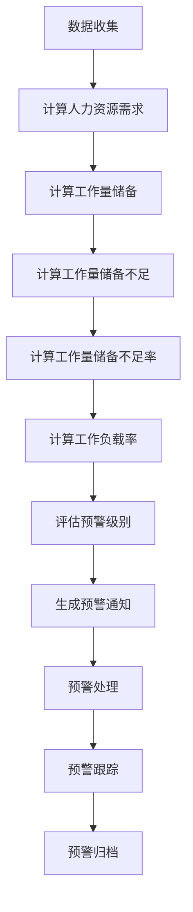

# 工作量储备不足计算方法

## 1. 概念定义

### 1.1 核心概念

| 概念 | 定义 | 单位 | 计算方法 |
|------|------|------|----------|
| **工作量储备** | 企业为完成预期工作任务而配备的人力资源总量 | 人时 | 现有员工数量 × 人均可用工作时长 × 工作效率系数 |
| **工作量储备不足** | 现有人力资源无法满足预期工作任务需求的情况 | 人时 | 人力资源需求 - 工作量储备 |
| **工作负载率** | 实际工作量与可用人力资源的比率 | % | 实际工作量 ÷ 工作量储备 × 100% |
| **人力资源需求** | 完成预期工作任务所需的人力资源总量 | 人时 | Σ（任务预计工作量 ÷ 人均工作效率） |
| **工作量储备不足率** | 工作量储备不足的程度 | % | （工作量储备不足 ÷ 人力资源需求）× 100% |
| **人员缺口** | 需要补充的员工数量 | 人 | 工作量储备不足 ÷ 人均可用工作时长 ÷ 工作效率系数 |
| **工时缺口** | 需要增加的工作时长 | 小时 | 工作量储备不足 ÷ 工作效率系数 |

### 1.2 相关概念

| 概念 | 定义 | 单位 | 计算方法 |
|------|------|------|----------|
| **任务预计工作量** | 完成单个任务所需的工作时长 | 小时 | 基于历史数据、任务复杂度和经验估算 |
| **人均工作效率** | 单位时间内完成的工作量 | 任务数/小时 | 历史完成任务数 ÷ 历史工作时长 |
| **人均可用工作时长** | 员工在单位时间内可用于工作的时长 | 小时/人/周期 | 标准工作时长 - 休息时间 - 其他非工作时间 |
| **工作效率系数** | 考虑工作强度、技能水平等因素的调整系数 | - | 基于历史数据和经验估算 |
| **标准工作时长** | 员工在单位时间内的标准工作时长 | 小时/人/周期 | 根据国家法律法规和企业制度确定 |
| **任务积压** | 预计无法按时完成的任务数量 | 任务数 | 总任务数 - 可完成任务数 |
| **可完成任务数** | 在现有工作量储备下可完成的任务数量 | 任务数 | 工作量储备 × 人均工作效率 |

## 2. 计算方法

### 2.1 人力资源需求计算

#### 2.1.1 单任务人力资源需求

**公式**：
```
单任务人力资源需求 = 任务预计工作量 ÷ 人均工作效率
```

**参数说明**：
- **任务预计工作量**：完成该任务所需的工作时长（小时）
- **人均工作效率**：单位时间内完成的工作量（任务数/小时）

**示例**：
- 任务预计工作量：10小时
- 人均工作效率：0.5任务数/小时
- 单任务人力资源需求：10 ÷ 0.5 = 20人时

#### 2.1.2 多任务人力资源需求

**公式**：
```
多任务人力资源需求 = Σ（单任务人力资源需求）
```

**参数说明**：
- **单任务人力资源需求**：每个任务的人力资源需求（人时）

**示例**：
- 任务1人力资源需求：20人时
- 任务2人力资源需求：15人时
- 任务3人力资源需求：25人时
- 多任务人力资源需求：20 + 15 + 25 = 60人时

#### 2.1.3 考虑任务优先级的人力资源需求

**公式**：
```
考虑任务优先级的人力资源需求 = Σ（单任务人力资源需求 × 优先级系数）
```

**参数说明**：
- **单任务人力资源需求**：每个任务的人力资源需求（人时）
- **优先级系数**：任务优先级的调整系数（高优先级：1.2，中优先级：1.0，低优先级：0.8）

**示例**：
- 任务1（高优先级）人力资源需求：20 × 1.2 = 24人时
- 任务2（中优先级）人力资源需求：15 × 1.0 = 15人时
- 任务3（低优先级）人力资源需求：25 × 0.8 = 20人时
- 考虑任务优先级的人力资源需求：24 + 15 + 20 = 59人时

### 2.2 工作量储备计算

#### 2.2.1 基本工作量储备

**公式**：
```
工作量储备 = 现有员工数量 × 人均可用工作时长 × 工作效率系数
```

**参数说明**：
- **现有员工数量**：参与工作的员工总数（人）
- **人均可用工作时长**：员工在单位时间内可用于工作的时长（小时/人/周期）
- **工作效率系数**：考虑工作强度、技能水平等因素的调整系数（-）

**示例**：
- 现有员工数量：5人
- 人均可用工作时长：8小时/人/天
- 工作效率系数：0.8
- 工作量储备：5 × 8 × 0.8 = 32人时/天

#### 2.2.2 考虑员工技能的工作量储备

**公式**：
```
考虑员工技能的工作量储备 = Σ（员工数量 × 人均可用工作时长 × 工作效率系数 × 技能匹配系数）
```

**参数说明**：
- **员工数量**：某技能等级的员工数量（人）
- **人均可用工作时长**：员工在单位时间内可用于工作的时长（小时/人/周期）
- **工作效率系数**：考虑工作强度等因素的调整系数（-）
- **技能匹配系数**：员工技能与任务需求的匹配程度（-）

**示例**：
- 高级技能员工：2人，技能匹配系数：1.2
- 中级技能员工：2人，技能匹配系数：1.0
- 初级技能员工：1人，技能匹配系数：0.8
- 人均可用工作时长：8小时/人/天
- 工作效率系数：0.8
- 考虑员工技能的工作量储备：(2×8×0.8×1.2) + (2×8×0.8×1.0) + (1×8×0.8×0.8) = 15.36 + 12.8 + 5.12 = 33.28人时/天

#### 2.2.3 考虑时间因素的工作量储备

**公式**：
```
考虑时间因素的工作量储备 = 基本工作量储备 × 时间调整系数
```

**参数说明**：
- **基本工作量储备**：不考虑时间因素的工作量储备（人时/周期）
- **时间调整系数**：考虑时间因素的调整系数（-）

**时间调整系数参考值**：
| 时间因素 | 调整系数 | 说明 |
|---------|---------|------|
| 正常工作时间 | 1.0 | 标准工作时间内的工作量储备 |
| 加班时间 | 0.8 | 加班时间内工作效率下降 |
| 节假日 | 0.6 | 节假日工作效率显著下降 |
| 高峰期 | 0.9 | 高峰期工作强度大，效率略有下降 |

**示例**：
- 基本工作量储备：32人时/天
- 时间调整系数（加班时间）：0.8
- 考虑时间因素的工作量储备：32 × 0.8 = 25.6人时/天

### 2.3 工作量储备不足计算

#### 2.3.1 基本工作量储备不足

**公式**：
```
工作量储备不足 = 人力资源需求 - 工作量储备
```

**参数说明**：
- **人力资源需求**：完成预期工作任务所需的人力资源总量（人时）
- **工作量储备**：企业为完成预期工作任务而配备的人力资源总量（人时）

**结果说明**：
- 结果 > 0：存在工作量储备不足
- 结果 = 0：工作量储备刚好满足需求
- 结果 < 0：工作量储备过剩

**示例**：
- 人力资源需求：40人时/天
- 工作量储备：32人时/天
- 工作量储备不足：40 - 32 = 8人时/天

#### 2.3.2 工作量储备不足率

**公式**：
```
工作量储备不足率 = （工作量储备不足 ÷ 人力资源需求）× 100%
```

**参数说明**：
- **工作量储备不足**：现有人力资源无法满足预期工作任务需求的情况（人时）
- **人力资源需求**：完成预期工作任务所需的人力资源总量（人时）

**结果说明**：
- 结果 > 0：存在工作量储备不足
- 结果 = 0：工作量储备刚好满足需求
- 结果 < 0：工作量储备过剩

**示例**：
- 工作量储备不足：8人时/天
- 人力资源需求：40人时/天
- 工作量储备不足率：（8 ÷ 40）× 100% = 20%

#### 2.3.3 人员缺口计算

**公式**：
```
人员缺口 = 工作量储备不足 ÷ 人均可用工作时长 ÷ 工作效率系数
```

**参数说明**：
- **工作量储备不足**：现有人力资源无法满足预期工作任务需求的情况（人时）
- **人均可用工作时长**：员工在单位时间内可用于工作的时长（小时/人/周期）
- **工作效率系数**：考虑工作强度、技能水平等因素的调整系数（-）

**示例**：
- 工作量储备不足：8人时/天
- 人均可用工作时长：8小时/人/天
- 工作效率系数：0.8
- 人员缺口：8 ÷ 8 ÷ 0.8 = 1.25人

#### 2.3.4 工时缺口计算

**公式**：
```
工时缺口 = 工作量储备不足 ÷ 工作效率系数
```

**参数说明**：
- **工作量储备不足**：现有人力资源无法满足预期工作任务需求的情况（人时）
- **工作效率系数**：考虑工作强度、技能水平等因素的调整系数（-）

**示例**：
- 工作量储备不足：8人时/天
- 工作效率系数：0.8
- 工时缺口：8 ÷ 0.8 = 10小时/天

### 2.4 工作负载率计算

#### 2.4.1 基本工作负载率

**公式**：
```
工作负载率 = （实际工作量 ÷ 工作量储备）× 100%
```

**参数说明**：
- **实际工作量**：员工实际完成的工作量（人时）
- **工作量储备**：企业为完成预期工作任务而配备的人力资源总量（人时）

**结果说明**：
- 结果 < 70%：低负载，工作量储备过剩
- 70% ≤ 结果 ≤ 100%：正常负载，工作量储备合理
- 100% < 结果 ≤ 120%：高负载，工作量储备略不足
- 结果 > 120%：超负荷，工作量储备严重不足

**示例**：
- 实际工作量：35人时/天
- 工作量储备：32人时/天
- 工作负载率：（35 ÷ 32）× 100% = 109.375%

#### 2.4.2 考虑任务优先级的工作负载率

**公式**：
```
考虑任务优先级的工作负载率 = （Σ（实际完成任务工作量 × 优先级系数）÷ 工作量储备）× 100%
```

**参数说明**：
- **实际完成任务工作量**：员工实际完成的单个任务工作量（人时）
- **优先级系数**：任务优先级的调整系数（高优先级：1.2，中优先级：1.0，低优先级：0.8）
- **工作量储备**：企业为完成预期工作任务而配备的人力资源总量（人时）

**示例**：
- 高优先级任务工作量：15人时/天，优先级系数：1.2
- 中优先级任务工作量：15人时/天，优先级系数：1.0
- 低优先级任务工作量：5人时/天，优先级系数：0.8
- 工作量储备：32人时/天
- 考虑任务优先级的工作负载率：（(15×1.2)+(15×1.0)+(5×0.8) ÷ 32）× 100% = （18+15+4 ÷ 32）× 100% = （37 ÷ 32）× 100% = 115.625%

#### 2.4.3 部门工作负载率

**公式**：
```
部门工作负载率 = （部门实际工作量 ÷ 部门工作量储备）× 100%
```

**参数说明**：
- **部门实际工作量**：部门员工实际完成的工作量（人时）
- **部门工作量储备**：部门为完成预期工作任务而配备的人力资源总量（人时）

**示例**：
- 部门实际工作量：120人时/天
- 部门工作量储备：100人时/天
- 部门工作负载率：（120 ÷ 100）× 100% = 120%

## 3. 预警机制

### 3.1 预警级别

| 预警级别 | 定义 | 触发条件 | 处理方式 |
|---------|------|---------|----------|
| **轻微不足** | 工作量储备略有不足，可能影响部分非关键任务的完成 | 工作量储备不足率 < 5% 且工作负载率 ≤ 105% | 密切监控，适当调整工作安排 |
| **中度不足** | 工作量储备明显不足，可能影响部分关键任务的完成 | 5% ≤ 工作量储备不足率 < 10% 且 105% < 工作负载率 ≤ 115% | 立即调整工作安排，考虑加班或临时人员 |
| **严重不足** | 工作量储备严重不足，可能影响大部分任务的完成 | 工作量储备不足率 ≥ 10% 且 工作负载率 > 115% | 紧急调整工作安排，必须加班或招聘临时人员 |
| **极端不足** | 工作量储备极端不足，几乎无法完成任何任务 | 工作量储备不足率 ≥ 20% 且 工作负载率 > 130% | 启动应急预案，考虑外部资源或项目延期 |

### 3.2 预警指标

| 预警指标 | 定义 | 计算方法 | 预警阈值 |
|---------|------|---------|----------|
| **工作量储备不足率** | 工作量储备不足的程度 | （工作量储备不足 ÷ 人力资源需求）× 100% | 5%（轻微），10%（中度），20%（严重） |
| **工作负载率** | 实际工作量与可用工作量的比率 | （实际工作量 ÷ 工作量储备）× 100% | 105%（轻微），115%（中度），130%（严重） |
| **人员缺口** | 需要补充的员工数量 | 工作量储备不足 ÷ 人均可用工作时长 ÷ 工作效率系数 | 1人（轻微），2人（中度），3人（严重） |
| **工时缺口** | 需要增加的工作时长 | 工作量储备不足 ÷ 工作效率系数 | 10小时/天（轻微），20小时/天（中度），30小时/天（严重） |
| **任务积压率** | 任务积压的程度 | （任务积压数 ÷ 总任务数）× 100% | 5%（轻微），10%（中度），20%（严重） |
| **平均工作时长** | 员工实际工作时长 | 总工作时长 ÷ 员工数量 | 8.5小时/天（轻微），9小时/天（中度），10小时/天（严重） |
| **加班频率** | 员工加班的频率 | 加班天数 ÷ 总工作日数 | 20%（轻微），30%（中度），50%（严重） |

### 3.3 预警触发流程



### 3.4 预警通知方式

| 预警级别 | 通知方式 | 通知对象 | 通知频率 |
|---------|---------|---------|----------|
| **轻微不足** | 系统通知 | 部门负责人 | 每日一次 |
| **中度不足** | 系统通知、邮件 | 部门负责人、分管领导 | 每日一次 |
| **严重不足** | 系统通知、邮件、短信 | 部门负责人、分管领导、总经理 | 实时通知 |
| **极端不足** | 系统通知、邮件、短信、电话 | 部门负责人、分管领导、总经理、董事长 | 实时通知，每小时跟进 |

### 3.5 预警处理流程

1. **预警确认**：
   - 接收预警通知
   - 确认预警信息的准确性
   - 评估预警的紧急程度

2. **原因分析**：
   - 分析工作量储备不足的原因
   - 评估影响范围和程度
   - 确定主要问题和次要问题

3. **制定方案**：
   - 基于原因分析制定处理方案
   - 评估方案的可行性和效果
   - 选择最优处理方案

4. **执行方案**：
   - 实施选定的处理方案
   - 分配任务和责任
   - 跟踪执行进度

5. **效果评估**：
   - 评估处理方案的效果
   - 检查工作量储备不足是否得到解决
   - 总结经验教训

6. **预警关闭**：
   - 确认工作量储备不足问题已解决
   - 关闭预警通知
   - 归档预警记录

## 4. 应对措施

### 4.1 短期措施

#### 4.1.1 工作时间调整

| 措施 | 适用场景 | 实施方法 | 预期效果 | 注意事项 |
|------|---------|---------|----------|----------|
| **安排加班** | 工作量储备不足率 < 10% | 组织员工加班，延长工作时间 | 快速增加工时缺口，缓解工作量压力 | 注意加班时长，避免过度疲劳 |
| **调整工作班次** | 工作量分布不均 | 调整员工工作班次，优化工作时间安排 | 平衡工作量分布，提高工作效率 | 确保员工休息时间，避免影响健康 |
| **灵活工作时间** | 工作量波动较大 | 实施弹性工作制，允许员工灵活安排工作时间 | 提高员工工作积极性，适应工作量波动 | 确保工作质量和沟通效率 |

#### 4.1.2 工作流程优化

| 措施 | 适用场景 | 实施方法 | 预期效果 | 注意事项 |
|------|---------|---------|----------|----------|
| **简化工作流程** | 工作流程复杂，效率低下 | 分析并简化工作流程，去除冗余环节 | 提高工作效率，减少工作量需求 | 确保简化后流程的完整性和质量 |
| **自动化处理** | 重复性工作较多 | 引入自动化工具，减少人工操作 | 提高工作效率，降低人力资源需求 | 确保自动化工具的可靠性和安全性 |
| **标准化操作** | 工作方法不统一 | 制定标准化操作流程，统一工作方法 | 提高工作效率和质量，减少错误 | 确保标准流程的合理性和可操作性 |

#### 4.1.3 任务管理优化

| 措施 | 适用场景 | 实施方法 | 预期效果 | 注意事项 |
|------|---------|---------|----------|----------|
| **任务优先级调整** | 任务优先级不合理 | 重新评估任务优先级，优先处理关键任务 | 确保关键任务按时完成，减少非关键任务压力 | 与相关方沟通，确保优先级调整的合理性 |
| **任务拆分** | 任务过大，难以管理 | 将大任务拆分为小任务，分阶段完成 | 提高任务完成的可控性和可见性 | 确保任务拆分的合理性和连贯性 |
| **任务外包** | 工作量储备严重不足 | 将部分任务外包给外部供应商 | 快速增加人力资源，缓解工作量压力 | 选择可靠的供应商，确保工作质量 |

### 4.2 中期措施

#### 4.2.1 人员调整

| 措施 | 适用场景 | 实施方法 | 预期效果 | 注意事项 |
|------|---------|---------|----------|----------|
| **临时雇佣** | 工作量储备不足率 ≥ 10% | 临时雇佣兼职人员或临时工 | 快速增加人力资源，缓解工作量压力 | 确保临时人员的技能水平和可靠性 |
| **跨部门借调** | 部门间工作量分布不均 | 从工作量不足的部门借调人员 | 平衡部门间工作量，提高资源利用率 | 与借调部门协商，确保不影响其工作 |
| **内部培训** | 员工技能水平不足 | 开展内部培训，提高员工技能水平 | 提高员工工作效率，减少人力资源需求 | 选择合适的培训内容和方式，确保培训效果 |

#### 4.2.2 流程优化

| 措施 | 适用场景 | 实施方法 | 预期效果 | 注意事项 |
|------|---------|---------|----------|----------|
| **业务流程重组** | 工作流程严重不合理 | 重新设计业务流程，优化工作方式 | 显著提高工作效率，减少人力资源需求 | 充分调研和论证，确保流程重组的合理性 |
| **信息化建设** | 信息传递效率低下 | 引入信息系统，优化信息传递和处理 | 提高信息处理效率，减少沟通成本 | 选择适合企业需求的信息系统，确保系统的易用性和可靠性 |
| **协作模式优化** | 团队协作效率低下 | 优化团队协作模式，提高团队凝聚力 | 提高团队工作效率，减少内耗 | 注重团队文化建设，确保协作模式的可行性 |

#### 4.2.3 资源配置优化

| 措施 | 适用场景 | 实施方法 | 预期效果 | 注意事项 |
|------|---------|---------|----------|----------|
| **设备升级** | 设备性能不足，影响工作效率 | 升级设备，提高设备性能 | 提高工作效率，减少人力资源需求 | 评估设备升级的成本和收益，确保投资回报率 |
| **工作环境改善** | 工作环境不佳，影响工作效率 | 改善工作环境，提高员工舒适度 | 提高员工工作积极性和效率 | 注重员工需求，确保工作环境改善的有效性 |
| **工具优化** | 工作工具落后，影响工作效率 | 引入先进的工作工具，优化工作方式 | 提高工作效率，减少人力资源需求 | 选择适合企业需求的工具，确保工具的易用性和可靠性 |

### 4.3 长期措施

#### 4.3.1 人员规划

| 措施 | 适用场景 | 实施方法 | 预期效果 | 注意事项 |
|------|---------|---------|----------|----------|
| **人力资源规划** | 长期工作量储备不足 | 基于业务发展规划，制定人力资源规划 | 确保人力资源与业务需求匹配 | 定期评估和调整人力资源规划，确保其与业务发展一致 |
| **人才储备** | 关键岗位人员不足 | 建立人才储备机制，提前培养和储备人才 | 确保关键岗位有足够的人才储备 | 注重人才的培养和发展，提高人才的忠诚度 |
| **招聘策略优化** | 招聘效率低下，难以吸引人才 | 优化招聘策略，提高招聘效率和质量 | 快速招聘到合适的人才，满足人力资源需求 | 注重招聘渠道的选择和招聘流程的优化 |

#### 4.3.2 流程优化

| 措施 | 适用场景 | 实施方法 | 预期效果 | 注意事项 |
|------|---------|---------|----------|----------|
| **精益管理** | 流程浪费严重，效率低下 | 引入精益管理理念，消除流程浪费 | 显著提高工作效率，减少人力资源需求 | 注重持续改进，确保精益管理的有效性 |
| **六西格玛管理** | 工作质量不稳定，缺陷率高 | 引入六西格玛管理方法，提高工作质量 | 减少返工和错误，提高工作效率 | 注重数据驱动和持续改进 |
| **敏捷管理** | 市场需求变化快，项目周期长 | 引入敏捷管理方法，提高项目灵活性 | 快速响应市场需求，提高项目效率 | 注重团队协作和持续交付 |

#### 4.3.3 组织优化

| 措施 | 适用场景 | 实施方法 | 预期效果 | 注意事项 |
|------|---------|---------|----------|----------|
| **组织结构调整** | 组织结构不合理，层级过多 | 优化组织结构，减少层级，提高扁平化程度 | 提高信息传递效率和决策速度 | 注重组织结构与业务需求的匹配 |
| **岗位设置优化** | 岗位职责不清，工作重叠 | 优化岗位设置，明确岗位职责 | 减少工作重叠，提高工作效率 | 注重岗位设置的合理性和完整性 |
| **绩效管理优化** | 绩效考核不合理，影响员工积极性 | 优化绩效管理体系，提高考核的公平性和有效性 | 提高员工工作积极性和效率 | 注重绩效指标的合理性和可操作性 |

### 4.4 应对措施效果评估

| 评估维度 | 评估指标 | 评估方法 | 预期目标 |
|---------|---------|---------|----------|
| **工作量储备** | 工作量储备不足率 | （工作量储备不足 ÷ 人力资源需求）× 100% | < 5% |
| **工作效率** | 人均工作效率 | 历史完成任务数 ÷ 历史工作时长 | 提高10%以上 |
| **工作质量** | 任务完成质量 | 合格任务数 ÷ 总任务数 × 100% | ≥ 95% |
| **员工满意度** | 员工满意度调查 | 问卷调查 | ≥ 80% |
| **成本效益** | 人力资源成本回报率 | 业务收入 ÷ 人力资源成本 | 提高5%以上 |
| **客户满意度** | 客户满意度调查 | 问卷调查 | ≥ 90% |

## 5. 数据收集与分析

### 5.1 数据收集

#### 5.1.1 内部数据

| 数据类型 | 数据来源 | 收集频率 | 存储方式 | 用途 |
|---------|---------|---------|---------|------|
| **任务数据** | 任务管理系统 | 实时 | 数据库 | 计算任务预计工作量 |
| **工时数据** | 考勤系统 | 每日 | 数据库 | 计算实际工作量和工作负载率 |
| **员工数据** | 人力资源系统 | 实时 | 数据库 | 计算工作量储备和人员缺口 |
| **绩效数据** | 绩效管理系统 | 定期 | 数据库 | 计算工作效率和工作质量 |
| **财务数据** | 财务系统 | 定期 | 数据库 | 评估人力资源成本和效益 |

#### 5.1.2 外部数据

| 数据类型 | 数据来源 | 收集频率 | 存储方式 | 用途 |
|---------|---------|---------|---------|------|
| **行业基准** | 行业报告、调研机构 | 定期 | 文档 | 评估企业工作量储备水平 |
| **市场趋势** | 市场调研、行业分析 | 定期 | 文档 | 预测未来工作量需求 |
| **竞争对手数据** | 公开报告、市场调研 | 定期 | 文档 | 评估企业竞争力 |
| **法律法规** | 政府网站、法律数据库 | 实时 | 文档 | 确保合规性 |

### 5.2 数据处理

#### 5.2.1 数据清洗

1. **异常值处理**：
   - 识别和处理异常值
   - 使用统计方法（如标准差法、四分位距法）检测异常值
   - 对异常值进行修正或删除

2. **缺失值处理**：
   - 识别和处理缺失值
   - 使用均值、中位数、众数等方法填充缺失值
   - 对关键缺失值进行调查和补充

3. **数据标准化**：
   - 对数据进行标准化处理
   - 统一数据格式和单位
   - 确保数据的一致性和可比性

#### 5.2.2 数据分析

1. **描述性分析**：
   - 计算数据的基本统计量（均值、中位数、标准差等）
   - 分析数据的分布特征
   - 识别数据的趋势和模式

2. **预测性分析**：
   - 使用时间序列分析预测未来工作量需求
   - 使用回归分析建立工作量需求与影响因素的关系模型
   - 使用机器学习算法提高预测准确性

3. **规范性分析**：
   - 基于分析结果提出优化建议
   - 评估不同应对措施的效果
   - 制定最优的工作量管理策略

### 5.3 数据可视化

#### 5.3.1 图表类型

| 图表类型 | 适用场景 | 实现工具 | 示例 |
|---------|---------|---------|------|
| **仪表盘** | 展示关键指标和预警状态 | Power BI、Tableau、Excel | 工作负载率仪表盘 |
| **折线图** | 展示数据趋势和变化 | Power BI、Tableau、Excel | 工作量需求趋势图 |
| **柱状图** | 比较不同类别的数据 | Power BI、Tableau、Excel | 部门工作量分布图 |
| **饼图** | 展示数据的占比关系 | Power BI、Tableau、Excel | 工作量类型分布图 |
| **热力图** | 展示数据的密度和强度 | Power BI、Tableau | 工作量时间分布热力图 |
| **散点图** | 展示两个变量之间的关系 | Power BI、Tableau、Excel | 工作量与工作效率关系图 |
| **雷达图** | 展示多个维度的数据 | Power BI、Tableau、Excel | 各部门工作量储备情况雷达图 |

#### 5.3.2 报表类型

| 报表类型 | 内容 | 频率 | 受众 |
|---------|------|------|------|
| **日报** | 当日工作量储备情况、预警信息 | 每日 | 部门负责人 |
| **周报** | 本周工作量储备情况、趋势分析、预警处理情况 | 每周 | 部门负责人、分管领导 |
| **月报** | 本月工作量储备情况、月度趋势、预警总结、应对措施效果 | 每月 | 部门负责人、分管领导、总经理 |
| **季报** | 季度工作量储备情况、季度趋势、预警分析、长期应对措施 | 每季度 | 高管团队 |
| **年报** | 年度工作量储备情况、年度趋势、预警总结、战略建议 | 每年 | 董事会 |

## 6. 实施建议

### 6.1 实施步骤

1. **准备阶段**：
   - 成立实施团队
   - 制定实施计划
   - 收集和整理相关数据
   - 确定计算参数和阈值

2. **试点阶段**：
   - 选择一个部门进行试点
   - 实施工作量储备不足计算方法
   - 收集反馈和数据
   - 调整和优化计算方法

3. **推广阶段**：
   - 向所有部门推广实施
   - 培训相关人员
   - 建立完善的工作流程
   - 持续监控和优化

4. **成熟阶段**：
   - 建立长期的工作量管理机制
   - 定期评估和调整计算方法
   - 持续改进和创新

### 6.2 关键成功因素

1. **数据质量**：
   - 确保数据的准确性、完整性和及时性
   - 建立数据质量控制机制
   - 定期检查和验证数据

2. **组织支持**：
   - 获得高层领导的支持和认可
   - 建立跨部门协作机制
   - 确保资源的合理配置

3. **技术支持**：
   - 选择合适的技术工具和平台
   - 确保系统的稳定性和可靠性
   - 提供必要的技术培训和支持

4. **人员能力**：
   - 提高员工的工作量管理意识
   - 培养员工的数据分析能力
   - 建立专业的工作量管理团队

5. **持续改进**：
   - 定期评估和调整计算方法
   - 收集和分析反馈意见
   - 持续优化工作流程和方法

### 6.3 注意事项

1. **数据安全**：
   - 确保数据的安全性和保密性
   - 建立数据访问控制机制
   - 定期备份和恢复数据

2. **合规性**：
   - 确保计算方法和应对措施符合法律法规
   - 遵守劳动法律法规，合理安排工作时间
   - 确保员工权益得到保障

3. **灵活性**：
   - 保持计算方法的灵活性和适应性
   - 根据实际情况调整计算参数和阈值
   - 适应业务需求的变化

4. **沟通协作**：
   - 加强部门间的沟通和协作
   - 及时共享工作量储备情况和预警信息
   - 建立有效的反馈机制

5. **平衡考虑**：
   - 平衡工作量储备和成本控制
   - 平衡工作效率和员工满意度
   - 平衡短期措施和长期战略

## 7. 案例分析

### 7.1 案例一：某餐饮企业服务高峰期工作量储备不足

#### 7.1.1 背景
- 企业类型：中型餐饮企业
- 问题：周末和节假日服务高峰期工作量储备不足，导致客户等待时间长，服务质量下降
- 现状：
  - 周末和节假日客流量是平时的2-3倍
  - 现有员工数量：20人
  - 人均可用工作时长：8小时/天
  - 工作效率系数：0.8

#### 7.1.2 分析
- 人力资源需求：
  - 平时：80人时/天
  - 高峰期：160-240人时/天
- 工作量储备：
  - 20人 × 8小时/天 × 0.8 = 128人时/天
- 工作量储备不足：
  - 高峰期：160-240 - 128 = 32-112人时/天
- 工作量储备不足率：
  - 高峰期：(32-112) ÷ (160-240) × 100% = 20%-46.7%
- 工作负载率：
  - 高峰期：(160-240) ÷ 128 × 100% = 125%-187.5%

#### 7.1.3 应对措施
- 短期措施：
  - 安排员工加班
  - 临时雇佣兼职人员
  - 调整工作班次，增加高峰期人手
- 中期措施：
  - 优化服务流程，提高服务效率
  - 引入自助点餐系统，减少人工操作
  - 培训员工，提高服务技能和效率
- 长期措施：
  - 优化招聘策略，建立灵活的用工机制
  - 调整组织结构，提高服务响应速度
  - 建立工作量预测模型，提前做好人员安排

#### 7.1.4 效果评估
- 实施前：
  - 客户等待时间：30-45分钟
  - 服务满意度：60%
  - 员工加班频率：40%
- 实施后：
  - 客户等待时间：15-20分钟
  - 服务满意度：85%
  - 员工加班频率：20%
- 改进效果：
  - 客户等待时间减少：50%
  - 服务满意度提高：25%
  - 员工加班频率减少：50%

### 7.2 案例二：某IT企业项目开发工作量储备不足

#### 7.2.1 背景
- 企业类型：小型IT企业
- 问题：项目开发工作量储备不足，导致项目延期，客户满意度下降
- 现状：
  - 同时进行3个项目
  - 现有开发人员：8人
  - 人均可用工作时长：8小时/天
  - 工作效率系数：0.9

#### 7.2.2 分析
- 人力资源需求：
  - 项目A：40人时/天
  - 项目B：30人时/天
  - 项目C：25人时/天
  - 总计：95人时/天
- 工作量储备：
  - 8人 × 8小时/天 × 0.9 = 57.6人时/天
- 工作量储备不足：
  - 95 - 57.6 = 37.4人时/天
- 工作量储备不足率：
  - 37.4 ÷ 95 × 100% = 39.37%
- 工作负载率：
  - 95 ÷ 57.6 × 100% = 164.93%

#### 7.2.3 应对措施
- 短期措施：
  - 安排员工加班
  - 项目优先级调整，暂缓非关键项目
  - 部分模块外包
- 中期措施：
  - 招聘临时开发人员
  - 优化开发流程，提高开发效率
  - 引入自动化测试工具，减少测试工作量
- 长期措施：
  - 制定合理的项目计划，避免项目并行度过高
  - 建立技术储备，提高开发效率
  - 优化团队结构，提高团队协作效率

#### 7.2.4 效果评估
- 实施前：
  - 项目延期率：60%
  - 客户满意度：70%
  - 员工加班频率：60%
- 实施后：
  - 项目延期率：20%
  - 客户满意度：90%
  - 员工加班频率：30%
- 改进效果：
  - 项目延期率减少：40%
  - 客户满意度提高：20%
  - 员工加班频率减少：30%

## 8. 总结

### 8.1 主要内容

本计算方法详细定义了工作量储备不足的相关概念，提供了全面的计算方法，包括人力资源需求计算、工作量储备计算、工作量储备不足计算和工作负载率计算。同时，本方法还设计了完善的预警机制和应对措施，以帮助企业及时发现和解决工作量储备不足问题。

### 8.2 核心价值

1. **科学决策**：基于数据和科学方法，为企业工作量管理提供决策依据
2. **提前预警**：通过预警机制，提前发现工作量储备不足问题
3. **有效应对**：提供全面的应对措施，帮助企业有效解决工作量储备不足问题
4. **持续改进**：建立长期的工作量管理机制，持续优化和改进

### 8.3 应用前景

本计算方法适用于各种类型和规模的企业，特别是服务型企业、项目型企业和制造业企业。通过实施本计算方法，企业可以：

1. **提高工作效率**：合理安排人力资源，提高工作效率和质量
2. **降低运营成本**：避免人力资源过剩或不足，优化成本结构
3. **提升客户满意度**：确保服务质量和交付时间，提升客户满意度
4. **增强企业竞争力**：通过科学的工作量管理，增强企业的竞争力

### 8.4 未来发展

随着企业管理的不断发展和技术的不断进步，工作量储备不足计算方法也需要不断创新和完善：

1. **技术创新**：利用人工智能、大数据等技术提高预测准确性和管理效率
2. **方法创新**：不断探索和创新工作量管理方法和工具
3. **实践创新**：结合企业实际情况，不断调整和优化计算方法
4. **理论创新**：深入研究工作量管理的理论和方法，推动学科发展

通过持续的创新和完善，工作量储备不足计算方法将为企业的可持续发展提供更有力的支持。